# Lab1_运算器及其应用

## 一、实验题目

运算器及其应用

## 二、实验目的

- 掌握算术逻辑单元 (ALU) 的功能
- 掌握数据通路和控制器的设计方法
- 掌握组合电路和时序电路，以及参数化和结构化的Verilog描述方法
- 了解查看电路性能和资源使用情况

## 三、实验平台

`Vivado`

## 四、实验过程与实验结果

### 1. 完成ALU模块的逻辑设计和仿真

`ALU`模块的代码如下

```verilog
module alu32
#(parameter WIDTH = 32)	//数据宽度
(
input  [WIDTH-1:0] a, b,	//两操作数（对于减运算，a是被减数）
input  [2:0] f,		//操作功能（加、减、与、或、异或等）
output  [WIDTH-1:0] y, 	//运算结果（和、差 …） 
output  z 			//零标志（运算结果为零，z置1）
);
reg [WIDTH-1:0] result;
assign y = result;
assign z = (result == 0) ? 1 : 0;
always @(*) begin
    case (f)
        3'b000: begin 
            result = a + b;
        end
        3'b001: begin
            result = a - b;
        end
        3'b010: begin 
            result = a & b;
        end
        3'b011: begin
            result = a | b;
        end
        3'b100: begin
            result = a ^ b;
        end
        default:begin
            result = 0;
        end
    endcase
end
endmodule
```

`仿真文件`如下

```verilog
module alu32test();
parameter WIDTH = 32;
reg  [WIDTH-1:0] a, b;	//两操作数（对于减运算，a是被减数）
reg  [2:0] f;		//操作功能（加、减、与、或、异或等）
wire  [WIDTH-1:0] y; 	//运算结果（和、差 …） 
wire  z; 			//零标志（运算结果为零，z置1）
alu32 alu32(a,b,f,y,z);

initial begin
a = 32'd10;
b = 32'd5;
f = 3'b000;
#10
f = 3'b001;
#10
f = 3'b010;
#10
f = 3'b011;
#10
f = 3'b100;
#10 $finish;
end
endmodule
```

`仿真结果`如下，输入`a=10`，`b=5`，依次进行`加、减、与、或、异或`运算，结果从`y`输出，`0标志`从`z`输出

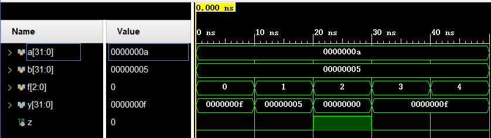

### 2.查看32位ALU的RTL和综合电路图，以及综合电路资源和时间性能报告

`RTL电路图`如下

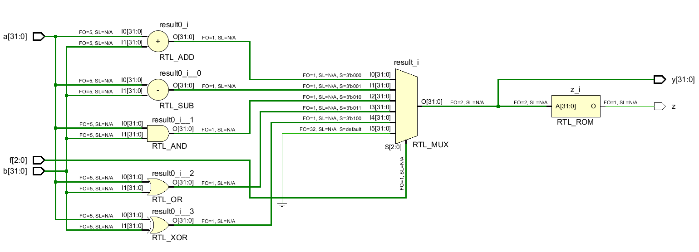

`综合电路图`如下

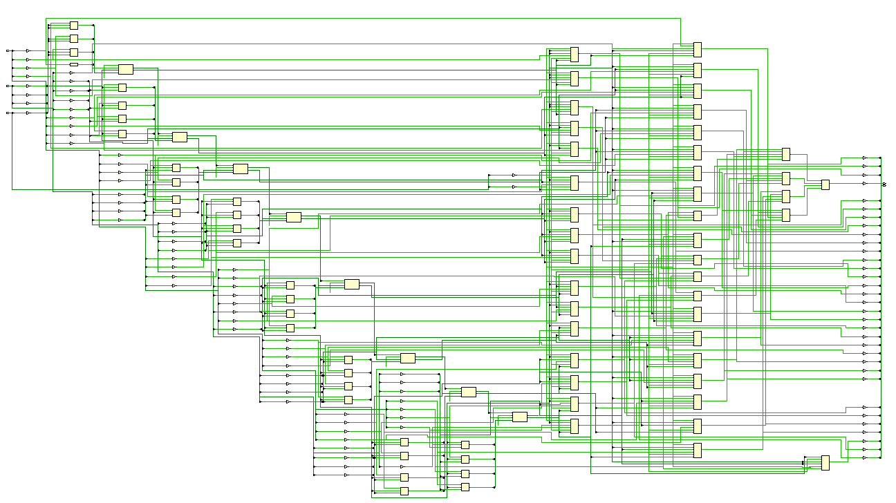

`综合电路资源`如下

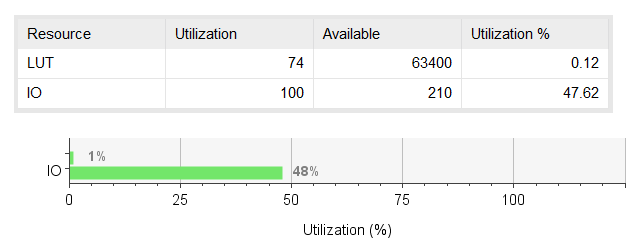

`时间性能报告`如下

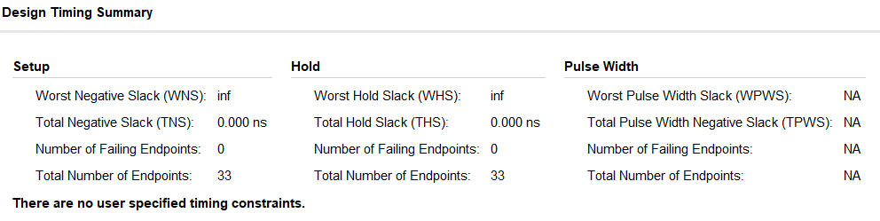

### 3.完成6位ALU的下载测试，并查看RTL电路图，以及实现电路资源和时间性能报告

6位`ALU`模块的代码如下

```verilog
module alu6
(
input clk,
input  en,
input  [1:0]sel,
input  [5:0] x,		
output  [5:0] y, 
output  z 			
);
reg [5:0] a,b;
reg [2:0] f;
alu32 #(6) alu(a,b,f,y,z);
always @(posedge clk) begin
    if(en)
    begin
        case (sel)
            2'b00: a <= x;
            2'b01: b <= x;
            2'b10: f <= x[2:0];
            2'b11:;
        endcase
    end
    else ;
end
endmodule
```

`约束文件`如下

```verilog
set_property -dict { PACKAGE_PIN E3    IOSTANDARD LVCMOS33 } [get_ports { clk }]; #IO_L12P_T1_MRCC_35 Sch=clk100mhz


##LEDs

set_property -dict { PACKAGE_PIN C17   IOSTANDARD LVCMOS33 } [get_ports { y[0] }]; #IO_L20N_T3_A19_15 Sch=ja[1]
set_property -dict { PACKAGE_PIN D18   IOSTANDARD LVCMOS33 } [get_ports { y[1] }]; #IO_L21N_T3_DQS_A18_15 Sch=ja[2]
set_property -dict { PACKAGE_PIN E18   IOSTANDARD LVCMOS33 } [get_ports { y[2] }]; #IO_L21P_T3_DQS_15 Sch=ja[3]
set_property -dict { PACKAGE_PIN G17   IOSTANDARD LVCMOS33 } [get_ports { y[3] }]; #IO_L18N_T2_A23_15 Sch=ja[4]
set_property -dict { PACKAGE_PIN D17   IOSTANDARD LVCMOS33 } [get_ports { y[4] }]; #IO_L16N_T2_A27_15 Sch=ja[7]
set_property -dict { PACKAGE_PIN E17   IOSTANDARD LVCMOS33 } [get_ports { y[5] }]; #IO_L16P_T2_A28_15 Sch=ja[8]
#set_property -dict { PACKAGE_PIN F18   IOSTANDARD LVCMOS33 } [get_ports { led[6] }]; #IO_L22N_T3_A16_15 Sch=ja[9]
set_property -dict { PACKAGE_PIN G18   IOSTANDARD LVCMOS33 } [get_ports { z }]; #IO_L22P_T3_A17_15 Sch=ja[10]


##Switches

set_property -dict { PACKAGE_PIN D14   IOSTANDARD LVCMOS33 } [get_ports { x[0] }]; #IO_L1P_T0_AD0P_15 Sch=jb[1]
set_property -dict { PACKAGE_PIN F16   IOSTANDARD LVCMOS33 } [get_ports { x[1] }]; #IO_L14N_T2_SRCC_15 Sch=jb[2]
set_property -dict { PACKAGE_PIN G16   IOSTANDARD LVCMOS33 } [get_ports { x[2] }]; #IO_L13N_T2_MRCC_15 Sch=jb[3]
set_property -dict { PACKAGE_PIN H14   IOSTANDARD LVCMOS33 } [get_ports { x[3] }]; #IO_L15P_T2_DQS_15 Sch=jb[4]
set_property -dict { PACKAGE_PIN E16   IOSTANDARD LVCMOS33 } [get_ports { x[4] }]; #IO_L11N_T1_SRCC_15 Sch=jb[7]
set_property -dict { PACKAGE_PIN F13   IOSTANDARD LVCMOS33 } [get_ports { x[5] }]; #IO_L5P_T0_AD9P_15 Sch=jb[8]
set_property -dict { PACKAGE_PIN G13   IOSTANDARD LVCMOS33 } [get_ports { sel[0] }]; #IO_0_15 Sch=jb[9]
set_property -dict { PACKAGE_PIN H16   IOSTANDARD LVCMOS33 } [get_ports { sel[1] }]; #IO_L13P_T2_MRCC_15 Sch=jb[10]


##Buttons

set_property -dict { PACKAGE_PIN B18   IOSTANDARD LVCMOS33     } [get_ports { en }]; #IO_L10P_T1_AD11P_15 Sch=xa_p[4]
```

`下载测试`如下，分时输入$a=(1011)_b \quad b=(11)_b$，分别进行`加、减、与、或、异或`运算

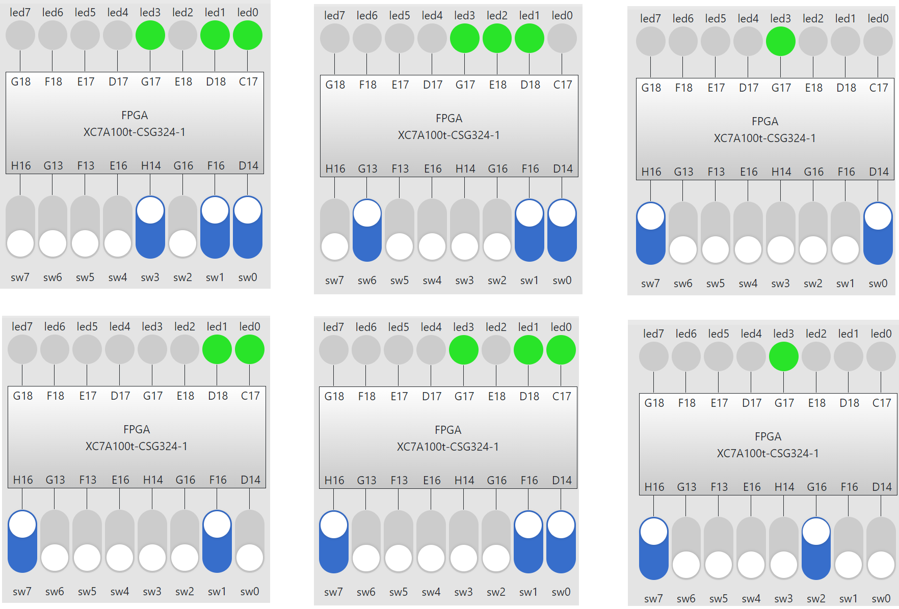

`RTL电路图`如下

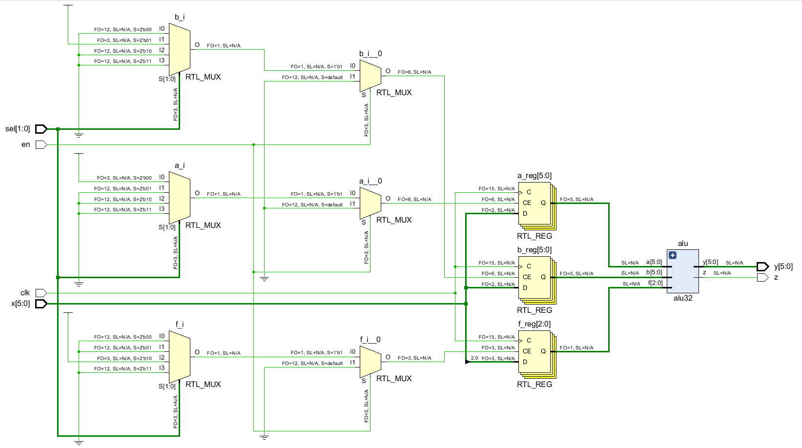

`实现电路资源`如下

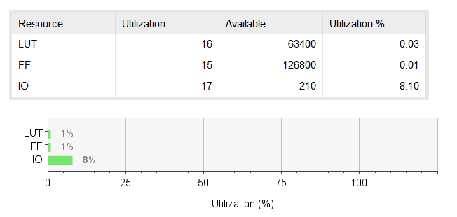

`时间性能报告`如下

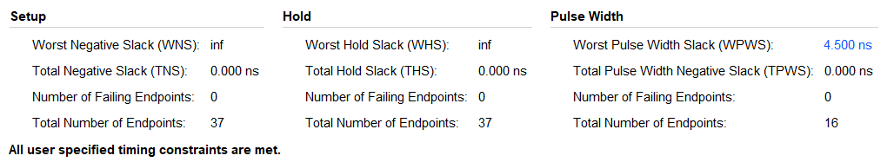

### 4.完成FLS的逻辑设计、仿真和下载测试

`状态转换图`如下，`S0`为复位后状态，第一次按下按钮后跳转至`S1`，第二次按下按钮跳转至`S2`，之后按下按钮保持在`S2`状态

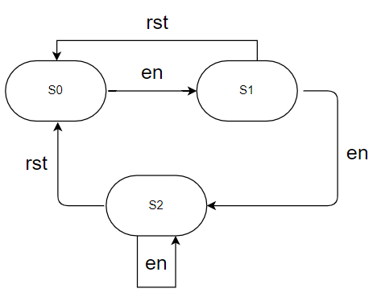

数据通路如下，`次态ns`由`现态cs`决定，`cs`根据`clk`、`rst`、`en`信号更新，输出的结果由`fn`产生，`fn`、`fn-1`、`fn-2`的值根据`d`、`clk`、`en`信号产生。

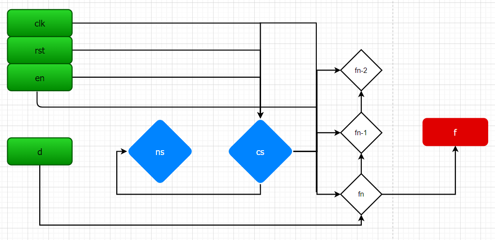

`FLS`模块与`开关去毛刺`和`去抖动`模块的代码如下

```verilog
module jitter_clr( 
input clk, 
input button, 
output button_clean );
reg [3:0] cnt; 
always@(posedge clk) 
begin
    if(button==1'b0) cnt <= 4'h0; 
    else if(cnt<4'h8) cnt <= cnt + 1'b1;
    else; 
end
assign button_clean = cnt[3]; 
endmodule

module signal_edge( 
input clk, 
input button, 
output button_edge); 
reg button_r1,button_r2; 
always@(posedge clk)
    button_r1 <= button; 
always@(posedge clk) 
    button_r2 <= button_r1; 
assign button_edge = button_r1 & (~button_r2); 
endmodule


module  fls (
input   clk, rst,        //时钟，复位（高电平有效）
input   en,	          //输入输出使能
input  [6:0]  d,      //输入数列初始项
output [6:0]  f       //输出数列
);

jitter_clr jitter_clr(clk,en,btn_clean);
signal_edge signal_edge(clk,btn_clean,btn_edge);

parameter S0 = 2'b00;
parameter S1 = 2'b01;
parameter S2 = 2'b10;

reg [6:0]   fn, fn_1, fn_2;
reg [1:0]   ns, cs;

wire z;
wire [6:0] sum;
alu32 #(7) alu(fn_1, fn, 3'b000, sum, z);

assign f = fn;

always @(posedge clk) begin
    if(rst) cs <= S0;
    else if(btn_edge) cs <= ns;
    else ;
end

always @(*) begin
    case (cs)
        S0: ns = S1;
        S1: ns = S2;
        S2: ns = S2;
        default : ns = S0;
    endcase
end

always @(posedge clk) begin
    case (cs)
        S0:
            if(btn_edge) fn <= d;
            else begin
                fn_2 <= 0;
                fn_1 <= 0;
                fn <= 0;
            end
        S1: 
            if(btn_edge) begin
                fn_1 <= fn;
                fn <= d;
            end
            else ;
        S2: 
            if(btn_edge) begin
                fn_2 <= fn_1;
                fn_1 <= fn;
                fn <= sum;
            end
            else ;
    endcase
end

endmodule
```

`约束文件`如下

```verilog
set_property -dict { PACKAGE_PIN E3    IOSTANDARD LVCMOS33 } [get_ports { clk }]; #IO_L12P_T1_MRCC_35 Sch=clk100mhz


##LEDs

set_property -dict { PACKAGE_PIN C17   IOSTANDARD LVCMOS33 } [get_ports { f[0] }]; #IO_L20N_T3_A19_15 Sch=ja[1]
set_property -dict { PACKAGE_PIN D18   IOSTANDARD LVCMOS33 } [get_ports { f[1] }]; #IO_L21N_T3_DQS_A18_15 Sch=ja[2]
set_property -dict { PACKAGE_PIN E18   IOSTANDARD LVCMOS33 } [get_ports { f[2] }]; #IO_L21P_T3_DQS_15 Sch=ja[3]
set_property -dict { PACKAGE_PIN G17   IOSTANDARD LVCMOS33 } [get_ports { f[3] }]; #IO_L18N_T2_A23_15 Sch=ja[4]
set_property -dict { PACKAGE_PIN D17   IOSTANDARD LVCMOS33 } [get_ports { f[4] }]; #IO_L16N_T2_A27_15 Sch=ja[7]
set_property -dict { PACKAGE_PIN E17   IOSTANDARD LVCMOS33 } [get_ports { f[5] }]; #IO_L16P_T2_A28_15 Sch=ja[8]
set_property -dict { PACKAGE_PIN F18   IOSTANDARD LVCMOS33 } [get_ports { f[6] }]; #IO_L22N_T3_A16_15 Sch=ja[9]
# set_property -dict { PACKAGE_PIN G18   IOSTANDARD LVCMOS33 } [get_ports { f[5] }]; #IO_L22P_T3_A17_15 Sch=ja[10]


##Switches

set_property -dict { PACKAGE_PIN D14   IOSTANDARD LVCMOS33 } [get_ports { d[0] }]; #IO_L1P_T0_AD0P_15 Sch=jb[1]
set_property -dict { PACKAGE_PIN F16   IOSTANDARD LVCMOS33 } [get_ports { d[1] }]; #IO_L14N_T2_SRCC_15 Sch=jb[2]
set_property -dict { PACKAGE_PIN G16   IOSTANDARD LVCMOS33 } [get_ports { d[2] }]; #IO_L13N_T2_MRCC_15 Sch=jb[3]
set_property -dict { PACKAGE_PIN H14   IOSTANDARD LVCMOS33 } [get_ports { d[3] }]; #IO_L15P_T2_DQS_15 Sch=jb[4]
set_property -dict { PACKAGE_PIN E16   IOSTANDARD LVCMOS33 } [get_ports { d[4] }]; #IO_L11N_T1_SRCC_15 Sch=jb[7]
set_property -dict { PACKAGE_PIN F13   IOSTANDARD LVCMOS33 } [get_ports { d[5] }]; #IO_L5P_T0_AD9P_15 Sch=jb[8]
set_property -dict { PACKAGE_PIN G13   IOSTANDARD LVCMOS33 } [get_ports { d[6] }]; #IO_0_15 Sch=jb[9]
set_property -dict { PACKAGE_PIN H16   IOSTANDARD LVCMOS33 } [get_ports { rst }]; #IO_L13P_T2_MRCC_15 Sch=jb[10]


##Buttons

set_property -dict { PACKAGE_PIN B18   IOSTANDARD LVCMOS33     } [get_ports { en }]; #IO_L10P_T1_AD11P_15 Sch=xa_p[4]
```

`仿真文件`如下

```verilog
module alu32test();
parameter WIDTH = 32;
reg  [WIDTH-1:0] a, b;	//两操作数（对于减运算，a是被减数）
reg  [2:0] f;		//操作功能（加、减、与、或、异或等）
wire  [WIDTH-1:0] y; 	//运算结果（和、差 …） 
wire  z; 			//零标志（运算结果为零，z置1）
alu32 alu32(a,b,f,y,z);

initial begin
a = 32'd10;
b = 32'd5;
f = 3'b000;
#10
f = 3'b001;
#10
f = 3'b010;
#10
f = 3'b011;
#10
f = 3'b100;
#10 $finish;
end
endmodule

module flstest();

reg clk,rst,en;
reg [6:0] d;
wire [6:0] f;
fls fls(clk,rst,en,d,f);

always #1 clk = ~clk;

initial
begin
    en = 0;clk = 0;d[6] = 0;rst = 1;
    #50
    rst = 0;
    d = 1;
    en = 1;
    #50 
    en = 0;
    d = 2;
    #50 
    en = 1;
    #50 
    en = 0;
    #50 
    en = 1;
    #50 
    en = 0;
    #50 
    en = 1;
    #50 
    en = 0;
    #50 
    en = 1;
    #50 
    en = 0;
    #50
    $finish;
end
endmodule
```

`仿真结果`如下，输入`f0=1`，`f1=2`，之后产生`f2=3`，`f3=5`，`f4=8`

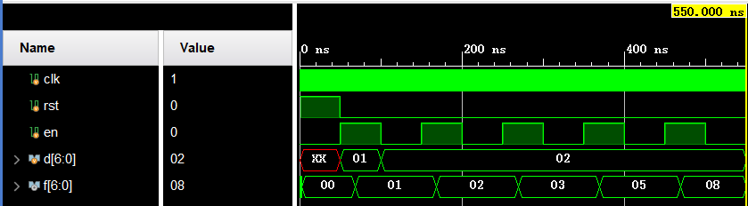

`下载测试`如下，输入`f0=1`，`f1=2`，之后产生`f2=3`，`f3=5`，`f4=8`，`f5=13`，`f6=21`，`f7=34`，`f8=55`，`f9=89`

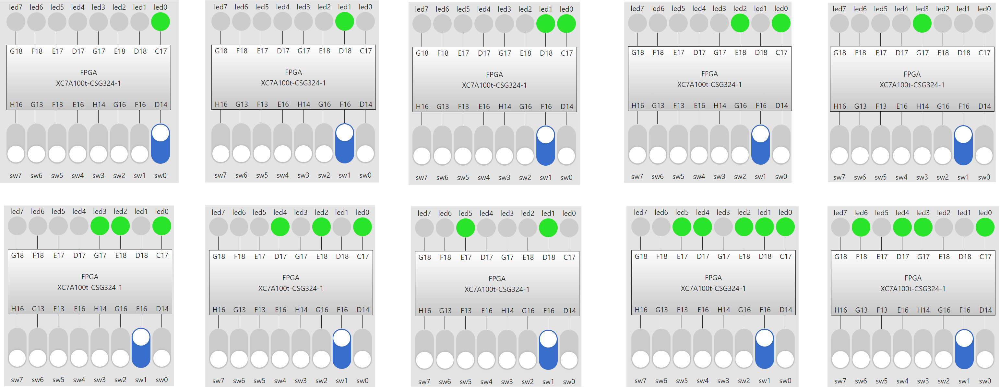

## 五、心得体会

​	通过这次实验了解了`ALU的设计与应用方法`、`查看电路性能`和`资源使用`情况、`参数化和结构化`的Verilog描述方法。
