# Lab2_寄存器堆与存储器及其应用

## 一、实验题目

寄存器堆与存储器及其应用

## 二、实验目的

- 掌握寄存器堆（Register File）和存储器的功能、时序及其应用
- 熟练掌握数据通路和控制器的设计和描述方法

## 三、实验平台

`Vivado`

## 四、实验过程与实验结果

### 1. 行为方式参数化描述寄存器堆，功能仿真

`寄存器堆`模块的代码如下

```verilog
module register_file
    #(parameter WIDTH = 32)(
    input clk,
    input [4:0] ra0,
    output [WIDTH-1:0] rd0,
    input [4:0] ra1,
    output [WIDTH-1:0] rd1,
    input [4:0] wa,
    input we,
    input [WIDTH-1:0] wd
    );

reg [WIDTH-1:0] regfile[0:31];

assign  rd0 = regfile[ra0],
        rd1 = regfile[ra1];

always @(posedge clk) begin
    if (we)  regfile[wa]  <=  wd;
end

endmodule
```

`仿真文件`如下

```verilog
module register_file_test();
parameter WIDTH = 4;
reg clk;
reg [4:0] ra0;
wire [WIDTH-1:0] rd0;
reg [4:0] ra1;
wire [WIDTH-1:0] rd1;
reg [4:0] wa;
reg we;
reg [WIDTH-1:0] wd;

register_file #(WIDTH)register_file(clk,ra0,rd0,ra1,rd1,wa,we,wd);

always #1 clk = ~clk;

initial begin
    clk = 0; ra0 = 3'd0; ra1 = 3'd1;
    #10
    we = 1; wa = ra0; wd = 4'd9;
    #10
    we = 0;
    #10
    we = 1; wa = ra1; wd = 4'd3;
    #10
    ra0 = 3'd1; ra1 = 3'd0;
    #10
    $finish;
end

endmodule
```

`仿真结果`如下，初始`ra0=0`，`ra1=1`，分别令`wa=0`和`wa=1`向寄存器写入`9`和`3`，观察到`rd0=9`，`rd1=3`，再交换`ra0`和`ra1`的值，观察到`rd0`和`rd1`的值也交换

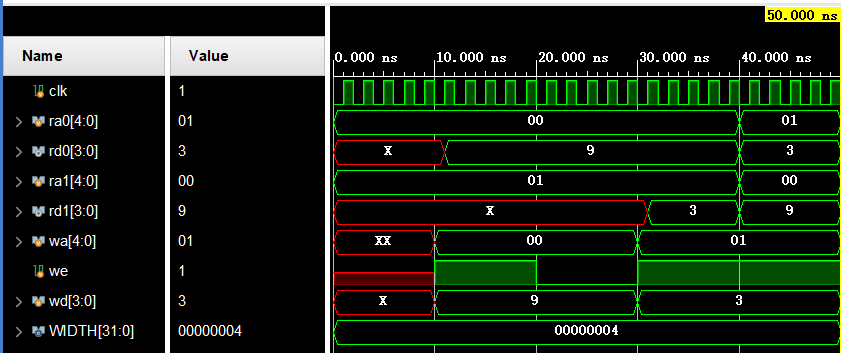

### 2.IP例化分布式和块式16 x 8位单端口RAM，功能仿真和对比

`分布式RAM`的配置如下

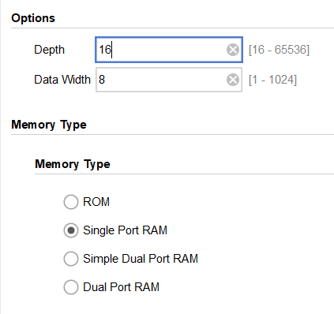

`块式RAM`的配置如下

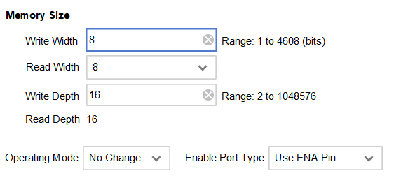

`分布式`和`块式`RAM的`COE`文件如下

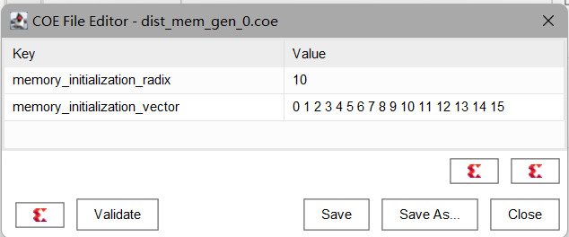

`分布式RAM`的`仿真文件`如下

```verilog
module dist_mem_gen_0_test();
reg [3:0] a;
reg [7:0] d;
reg clk;
reg we;
wire [7:0] spo;

dist_mem_gen_0 dist_mem_gen_0_test (
    .a(a),      // input wire [3 : 0] a
    .d(d),      // input wire [7 : 0] d
    .clk(clk),  // input wire clk
    .we(we),    // input wire we
    .spo(spo)  // output wire [7 : 0] spo
);

always #1 clk = ~ clk;

initial begin
    clk = 0; we = 0;
    #4
    a = 4'd0;
    #5
    a = 4'd1; we = 1; d = 8'b1111_1111;
    #6
    a = 4'd2; d = 8'b1111_0000;
    #5
    a = 4'd3; we = 0;
    #5
    $finish;
end

endmodule
```

`分布式RAM`的`仿真结果`如下，默认输出为`非寄存器型`，在`写使能`有效后，输出短暂维持`原始值`，随即变为`新写入的值`，而非等到`下一个时钟周期`才改变

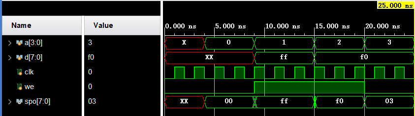

在将`分布式RAM`的输出改为`寄存器型`后，重新仿真，可以观察到`地址`改变后，输出在`时钟上升沿`才会发生变化，

同时，在向RAM`写入`数据后，输出会在下一个时钟`上升沿`时改变


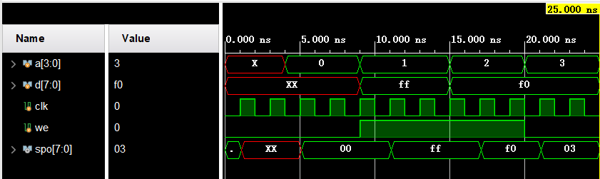

`块式RAM`的`仿真文件`如下

```verilog
module blk_mem_gen_0_test();
reg clka;
reg ena;
reg [0:0] wea;
reg [3:0] addra;
reg [7:0] dina;
wire [7:0] douta;

blk_mem_gen_0 your_instance_name (
    .clka(clka),    // input wire clka
    .ena(ena),      // input wire ena
    .wea(wea),      // input wire [0 : 0] wea
    .addra(addra),  // input wire [3 : 0] addra
    .dina(dina),    // input wire [7 : 0] dina
    .douta(douta)  // output wire [7 : 0] douta
);

always #1 clka = ~ clka;

initial begin
    clka = 0; wea = 0;
    #5
    ena = 1; addra = 4'd1;
    #5
    addra = 4'd2; wea = 1; dina = 8'b1111_1111;
    #5
    addra = 4'd3; wea = 1; dina = 8'b1111_0000;
    #5
    wea = 0;
    #5
    $finish;
end

endmodule
```

`块式RAM`的`仿真结果`如下，默认操作模式为`No Change`模式，在`写使能`有效后，`输出`仍保持`写使能`有效前的值，直到`写使能`无效后显示当前`addra`指向的寄存器的值

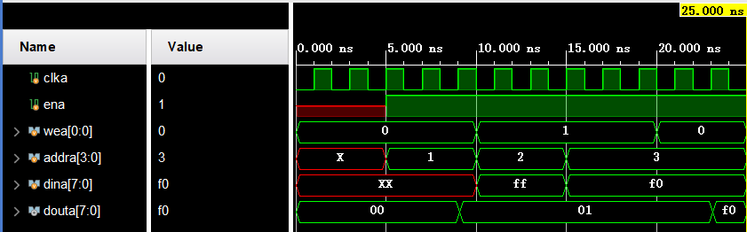

将操作模式改为`Write First`模式后重新仿真，在向RAM写入数据后，输出会在时钟`上升沿`时改变为写入的数据，即`优先`输出`写入的数据`

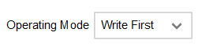

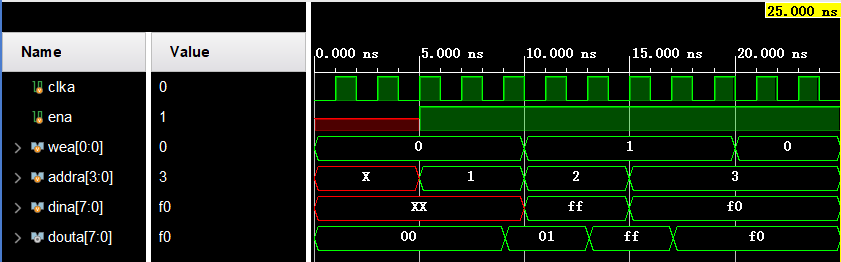

将操作模式改为`Read First`模式后重新仿真，在向RAM写入数据时，输出会`优先`输出`当前`寄存器的值，在写入`完成`后会输出`写入`的值


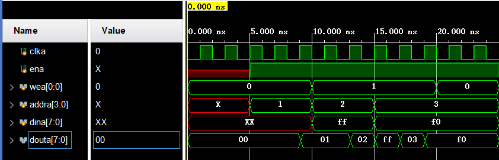

块式RAM的输出可以选择使用多级寄存器，以下为`不使用寄存器`、只使用`Primitives Register`、同时使用`Primitives Register`和`Core Register`的仿真结果对比，可以看到，输出的时钟延迟的变化


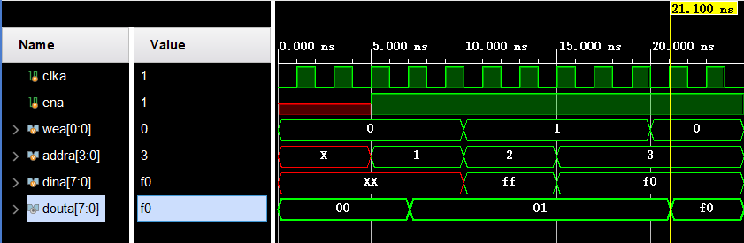


`分布式RAM`与`块式RAM`对比，分布式RAM`存储容量`上限较小，块式RAM`存储容量`上限较大，分布式RAM的`操作模式`类似于`Read First`，而块式RAM可选`No Change`、`Write First`、`Read First`三种模式，分布式RAM的`输出`可选`无寄存器`和`有寄存器`两种类型，块式RAM的输出有`两级寄存器`可选

### 3.设计FIFO队列电路的数据通路和控制器，结构化方式描述数据通路，Moore型FSM描述控制器，功能仿真

`FIFO`各模块的代码如下，含有`寄存器堆`模块(register_file_fifo)、`数码管输出`模块(Segment_Display_Unit)、`信号取边沿`模块(signal_edge)、`控制`模块(LCU)、`主模块`(FIFO)

`数码管输出模块`获得`head`、`tail`的位置，从而产生`hexplay_an`信号遍历`tail`与`head`之间的值，输出到数码管的控制端口，同时该信号接入`寄存器堆`模块，从寄存器堆读取相应的值从`hexplay_data`输出到`FPGA`的端口。使用`valid`信号判断队列是否为空，当队列为空时，在FPGA的第一个数码管显示0

`控制`模块使用`三段式`描述一个`有限状态机`，具有三个状态`IDLE`、`ENQU`、`DEQU`，复位后处于`IDLE`状态，在`入队`信号的上升沿，若队列非满，跳转到`ENQU`状态，同时改变`地址`、`写使能`、`数据信号`，向寄存器写入数据，然后跳转回`IDLE`状态，在`出队`信号的上升沿，若队列非空，跳转到`DEQU`状态，同时改变地址，从寄存器中读出数据显示在`FPGA`的`LED`上，然后跳转回`IDLE`状态

```verilog
module register_file_fifo
    #(parameter WIDTH = 32)(
    input clk,
    input [2:0] ra0,
    output [WIDTH-1:0] rd0,
    input [2:0] ra1,
    output [WIDTH-1:0] rd1,
    input [2:0] wa,
    input we,
    input [WIDTH-1:0] wd
    );

reg [WIDTH-1:0] regfile[0:7];

assign  rd0 = regfile[ra0],
        rd1 = regfile[ra1];

always @(posedge clk) begin
    if (we)  regfile[wa]  <=  wd;
end

endmodule


module Segment_Display_Unit(
	input clk,
	input valid,
    input [3:0] data,
	input [2:0] head,tail,
	output reg [2:0] hexplay_an,
	output [3:0] hexplay_data
);

reg [31:0] hexplay_cnt;

always@(posedge clk) begin
	if (hexplay_cnt >= (2000000 / 8)) hexplay_cnt <= 0;
	else hexplay_cnt <= hexplay_cnt + 1;
end

always@(posedge clk) begin
	if (hexplay_cnt == 0) begin
		if(valid == 1) hexplay_an = 0;
		else if(hexplay_an == (head - 3'b1)) hexplay_an <= tail;
		else hexplay_an <= hexplay_an + 3'b1;
	end
    else ;
end

assign hexplay_data = (valid == 0) ? data : 0;

endmodule

module signal_edge( 
input clk, 
input button, 
output button_edge); 
reg button_r1,button_r2; 
always@(posedge clk)
    button_r1 <= button; 
always@(posedge clk) 
    button_r2 <= button_r1; 
assign button_edge = button_r1 & (~button_r2); 
endmodule

module LCU(
	input clk,rst,
    input enq,
    input deq,
	input [3:0] rd0,
	output reg [3:0] out,
    output reg full, empty,
	output reg [2:0] head,tail,
	output reg we
);
parameter IDLE = 2'b00;
parameter ENQU = 2'b01;
parameter DEQU = 2'b10;

reg [1:0] cs, ns;
reg [2:0] timer;

signal_edge signal_edge_enq(clk,enq,enq_edge);
signal_edge signal_edge_deq(clk,deq,deq_edge);

always @(posedge clk) begin
    cs <= ns;
end

always @(*) begin
	if(timer == 0) ns = IDLE;
	else if(we == 1) ns = ENQU;
	else ns = DEQU;
end

always @(posedge clk) begin
	if(rst) begin
		head = 0; tail = 0; timer = 0; we = 0; empty = 1; out = 0; full = 0;
	end
	else begin
		if(timer == 0) we <= 0;
		else timer <= timer - 1;

		if(enq_edge && !full) begin
			timer <= 3'd7;
			we <= 1;
			head <= head + 1;
		end
		else if(deq_edge && !empty) begin
			timer <= 3'd7;
			tail <= tail + 1;
			out <= rd0;
		end
		else ;

		case (cs)
			ENQU:begin
				full <= (head == tail)? 1 : 0;
				empty <= 0;
			end
			DEQU:begin
				empty <= (head == tail)? 1 : 0;
				full <= 0;
			end
			default:; 
		endcase
	end
end

endmodule

module FIFO(
    input clk,rst,
    input enq,
    input deq,
	input [3:0] in,
	output [3:0] out,
    output full, empty,
	output [2:0] an,
	output [3:0] seg
);
parameter IDLE = 2'b00;
parameter ENQU = 2'b01;
parameter DEQU = 2'b10;

wire [2:0] head,tail;
reg [1:0] cs, ns;
reg [2:0] timer;
wire [3:0] rd0;
wire [3:0] rd1;
reg [2:0] wa;
wire we;

LCU LCU(clk,rst,enq,deq,rd0,out,full,empty,head,tail,we);
Segment_Display_Unit Segment_Display_Unit(clk,empty,rd1,head,tail,an,seg);
register_file_fifo #(4)register_file_fifo(clk,tail,rd0,an,rd1,head-3'd1,we,in);

endmodule
```

`RTL电路图`表示的`数据通路`如下

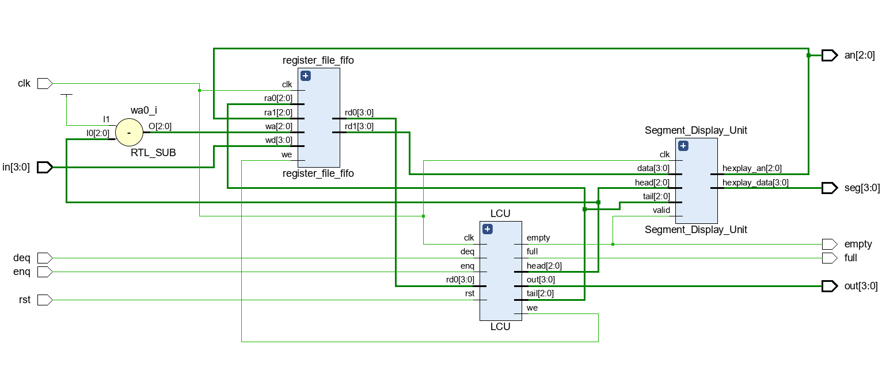

`仿真文件`如下

```verilog
module FIFO_test();

reg clk,rst;
reg enq;
reg deq;
reg [3:0] in;
wire [3:0] out;
wire full, empty;
wire [2:0] an;
wire [3:0] seg;

FIFO FIFO(clk,rst,enq,deq,in,out,full,empty,an,seg);

always #1 clk = ~clk;

initial begin
    clk = 0; rst = 1; enq = 0; deq = 0; in = 4'd0;
    #5
    rst = 0;
    #10
    in = 4'd0; enq = 1;
    #10
    enq = 0;
    #10
    in = 4'd1; enq = 1;
    #10
    enq = 0;
    #10
    in = 4'd2; enq = 1;
    #10
    enq = 0;
    #10
    in = 4'd3; enq = 1;
    #10
    enq = 0;
    #10
    in = 4'd4; enq = 1;
    #10
    enq = 0;
    #10
    in = 4'd5; enq = 1;
    #10
    enq = 0;
    #10
    in = 4'd6; enq = 1;
    #10
    enq = 0;
    #10
    in = 4'd7; enq = 1;
    #10
    enq = 0;
    #10
    in = 4'd8; enq = 1;
    #10
    enq = 0; deq = 1;
    #10
    deq = 0;
    #10
    deq = 1;
    #10
    deq = 0;
    #10
    deq = 1;
    #10
    deq = 0;
    #10
    deq = 1;
    #10
    deq = 0;
    #10
    in = 4'd9; enq = 1;
    #10
    deq = 1;
    #10
    deq = 0;
    #10
    deq = 1;
    #10
    deq = 0;
    #10
    deq = 1;
    #10
    deq = 0;
    #10
    deq = 1;
    #10
    deq = 0;
    #10
    deq = 1;
    #10
    deq = 0;
    #10
    $finish;
end

endmodule

```

`仿真结果`如下，复位后`empty`信号有效，依次将0、1、2、3、4、5、6、7入队，此时`full`信号有效，再试图将8入队，但因为队满而失败，然后依次将0、1、2、3出队，将9入队，再将4、5、6、7、9出队。

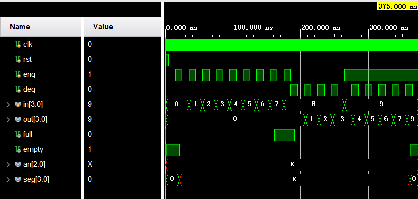

### 4.FIFO队列电路下载至FPGA中测试

`约束文件`如下

```verilog
## Clock signal
set_property -dict { PACKAGE_PIN E3    IOSTANDARD LVCMOS33 } [get_ports {clk }]; #IO_L12P_T1_MRCC_35 Sch=clk100mhz
create_clock -add -name sys_clk_pin -period 10.00 -waveform {0 5} [get_ports {clk}];


# FPGAOL LED (signle-digit-SEGPLAY)

set_property -dict { PACKAGE_PIN C17   IOSTANDARD LVCMOS33 } [get_ports { out[0] }];
set_property -dict { PACKAGE_PIN D18   IOSTANDARD LVCMOS33 } [get_ports { out[1] }];
set_property -dict { PACKAGE_PIN E18   IOSTANDARD LVCMOS33 } [get_ports { out[2] }];
set_property -dict { PACKAGE_PIN G17   IOSTANDARD LVCMOS33 } [get_ports { out[3] }];
# set_property -dict { PACKAGE_PIN D17   IOSTANDARD LVCMOS33 } [get_ports { tail[1] }];
# set_property -dict { PACKAGE_PIN E17   IOSTANDARD LVCMOS33 } [get_ports { tail[2] }];
set_property -dict { PACKAGE_PIN F18   IOSTANDARD LVCMOS33 } [get_ports { empty }];
set_property -dict { PACKAGE_PIN G18   IOSTANDARD LVCMOS33 } [get_ports { full }];


# FPGAOL SWITCH

set_property -dict { PACKAGE_PIN D14   IOSTANDARD LVCMOS33 } [get_ports { in[0] }];
set_property -dict { PACKAGE_PIN F16   IOSTANDARD LVCMOS33 } [get_ports { in[1] }];
set_property -dict { PACKAGE_PIN G16   IOSTANDARD LVCMOS33 } [get_ports { in[2] }];
set_property -dict { PACKAGE_PIN H14   IOSTANDARD LVCMOS33 } [get_ports { in[3] }];
#set_property -dict { PACKAGE_PIN E16   IOSTANDARD LVCMOS33 } [get_ports { sw[4] }];
set_property -dict { PACKAGE_PIN F13   IOSTANDARD LVCMOS33 } [get_ports { rst }];
set_property -dict { PACKAGE_PIN G13   IOSTANDARD LVCMOS33 } [get_ports { deq }];
set_property -dict { PACKAGE_PIN H16   IOSTANDARD LVCMOS33 } [get_ports { enq }];


# FPGAOL HEXPLAY

set_property -dict { PACKAGE_PIN A14   IOSTANDARD LVCMOS33 } [get_ports { seg[0] }];
set_property -dict { PACKAGE_PIN A13   IOSTANDARD LVCMOS33 } [get_ports { seg[1] }];
set_property -dict { PACKAGE_PIN A16   IOSTANDARD LVCMOS33 } [get_ports { seg[2] }];
set_property -dict { PACKAGE_PIN A15   IOSTANDARD LVCMOS33 } [get_ports { seg[3] }];
set_property -dict { PACKAGE_PIN B17   IOSTANDARD LVCMOS33 } [get_ports { an[0] }];
set_property -dict { PACKAGE_PIN B16   IOSTANDARD LVCMOS33 } [get_ports { an[1] }];
set_property -dict { PACKAGE_PIN A18   IOSTANDARD LVCMOS33 } [get_ports { an[2] }];
```

`下载测试`如下，复位后`empty`信号有效，依次将1、2、3、4、5、6、7、8入队，此时`full`信号有效，然后将1、2、3出队，将9入队

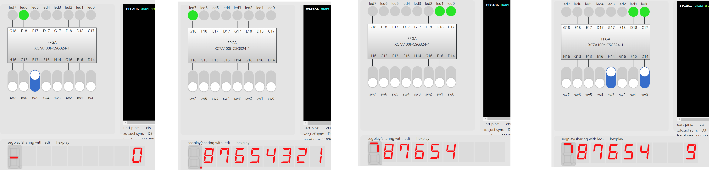

## 五、心得体会

​	通过这次实验了解了`寄存器堆（Register File）和存储器的功能、时序及其应用`、熟练掌握`数据通路`和`控制器`的设计和描述方法。
