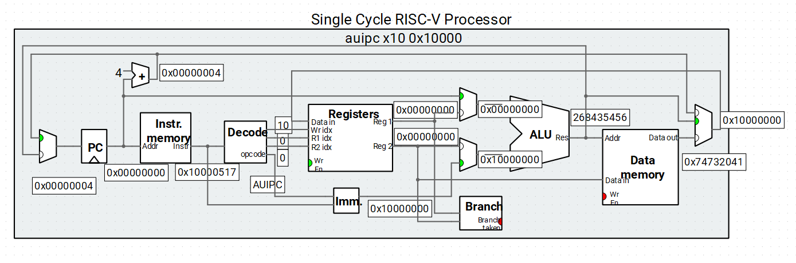
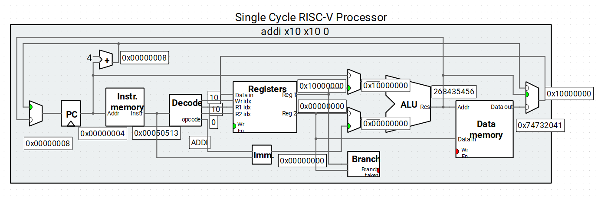
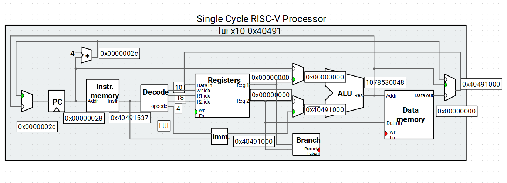
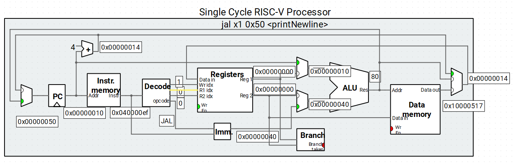
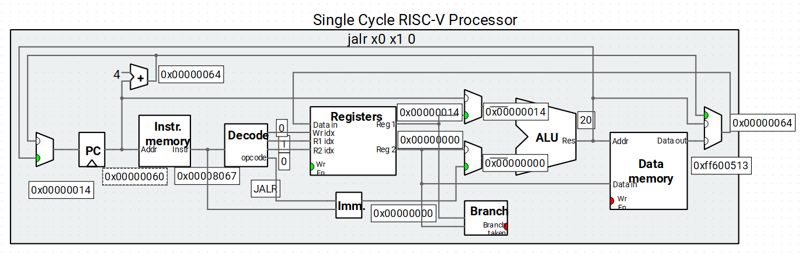
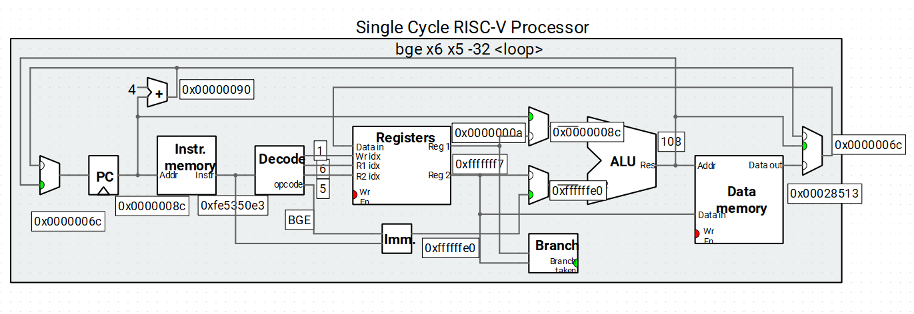
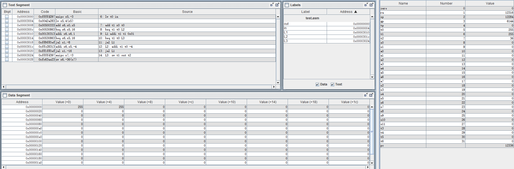

# Lab3_汇编程序设计

## 一、实验题目

汇编程序设计

## 二、实验目的

- 熟悉RISC-V汇编指令的格式 
- 熟悉CPU仿真软件Ripes，理解汇编指令执行的基本原理（数据通路和控制器的协调工作过程）
- 熟悉汇编程序的基本结构，掌握简单汇编程序的设计
- 掌握汇编仿真软件RARS(RISC-V Assembler & Runtime Simulator)的使用方法，会用该软件进行汇编程序的仿真、调试以及生成CPU测试需要的指令和数据文件（COE）
- 理解CPU调试模块PDU的使用方法

## 三、实验平台

`Ripes`、`RARS`

## 四、实验过程与实验结果

### 1. 理解并仿真RIPES示例汇编程序 (Console Printing)

`Console Printing`的代码如下，在`data`段定义了`str`、`newline`、`delimiter`三个字符串。`text`段分为六段，分别实现打印`字符串`、`整数`、`浮点数`、`字符`、`空行`、`循环打印`的功能。打印的基本实现结构是在`a0`参数寄存器存储要打印的值，或者要打印的`字符串的起始地址`，在`a7`参数寄存器存储`系统调用的参数`，`4`为打印字符串，`1`为打印整数，`2`为打印浮点数，`11`为打印字符。在循环打印部分，以`a0`和`a1`之间的整数作为打印的范围，`a2`作为打印的参数，即指定打印的类型，在示例中有打印`整数`和打印`整数在ASCII码表示的字符`两种使用方式。

```assembly
# This example demonstrates how strings, integers, chars and floating point
# values may be printed to the console

.data
str:        .string      "A string"
newline:    .string      "\n"
delimiter:  .string      ", "

.text
# ------ String printing ----------
    la a0, str # Load the address of the string, placed in the static data segment
    li a7, 4   # Argument '4' for ecall instructs ecall to print to console
    ecall

    jal printNewline

# ------ Integer printing ---------
# Print numbers in the range [-10:10]
    li a0, -10
    li a1, 10
    li a2, 1
    jal loopPrint

    jal printNewline

# -------- Float printing ----------
# Print an approximation of Pi (3.14159265359)
    li a0, 0x40490FDB
    li a7, 2
    ecall

    jal printNewline

# ------ ASCII character printing ---------
# Print ASCII characters in the range [33:53]
    li a0, 33
    li a1, 53
    li a2, 11
    jal loopPrint

    # Finish execution
    jal exit

# ====== Helper routines ======
printNewline:
    la a0, newline
    li a7, 4
    ecall
    jr x1

# --- LoopPrint ---
# Loops in the range [a0;a1] and prints the loop invariant to console
# a0: range start
# a1: range stop
# a2: print method (ecall argument)
loopPrint:
    addi t0, a0 0
    addi t1, a1 0
loop:
    # Print value in a0 as specified by argument a2
    addi a0, t0, 0
    addi a7, a2, 0
    ecall
    # Print a delimiter between the numbers
    li a7, 4
    la a0, delimiter
    ecall
    # Increment
    addi t0, t0, 1
    ble  t0, t1, loop
    jr x1

exit:
    li a7, 10
    ecall

```

在示例程序中用到的指令有`auipc`、`addi`、`lui`、`jal`、`jalr`、`bge`，以下在单周期CPU对各类指令执行时的数据通路仿真

`auipc x10 0x10000`

`instr.memory`模块输出当前`PC`所指向的指令，指令通过`Decode`模块解码得到当前指令为`auipc`，将`opcode`和`指令`传输给`Imm`模块，`Imm`输出`0x10000`左移12位后的结果`0x10000000`，`ALU`将立即数与`PC`相加，得到的值传递给`Register`，`Register`写使能有效，写地址输入`Decode`模块的输出`10`，则在`x10`寄存器存储`PC`与`0x10000000`相加的结果，`PC加4`，跳转到下一条指令。



`addi x10 x10 0`

`instr.memory`模块输出当前`PC`所指向的指令，指令通过`Decode`模块解码得到当前指令为`addi`，将`opcode`和`指令`传输给`Imm`模块，`Imm`输出立即数`0x00000000`，`Decode`模块将`10`传递给`Register`的R1端口，`Register`输出`x10`寄存器的值到`Reg1`，`ALU`将立即数与`Reg1`相加，得到的值传递给`Register`，`Register`写使能有效，写地址输入`Decode`模块的输出`10`，则在`x10`寄存器存储`x10`寄存器的值与`0x00000000`相加的结果，`PC加4`，跳转到下一条指令。



`lui x10 0x40491`

`instr.memory`模块输出当前`PC`所指向的指令，指令通过`Decode`模块解码得到当前指令为`lui`，将`opcode`和`指令`传输给`Imm`模块，`Imm`输出`0x40491`左移12位后的结果`0x40491000`，`ALU`将立即数与`0x00000000`相加，得到的值传递给`Register`，`Register`写使能有效，写地址输入`Decode`模块的输出`10`，则在`x10`寄存器存储`立即数`与`0x00000000`相加的结果，`PC加4`，跳转到下一条指令。



`jal x1 0x50`

`instr.memory`模块输出当前`PC`所指向的指令，指令通过`Decode`模块解码得到当前指令为`jal`，将`opcode`和`指令`传输给`Imm`模块，`Imm`输出立即数`0x00000040`，`ALU`将立即数与`PC`相加，得到的值传递给`PC`，实现指令跳转，`PC+4`的值传递给寄存器，`Register`写使能有效，写地址输入`Decode`模块的输出`1`，则在`x1`寄存器存储`PC+4`的值。



`jalr x0 x1 0`

`instr.memory`模块输出当前`PC`所指向的指令，指令通过`Decode`模块解码得到当前指令为`jalr`，将`opcode`和`指令`传输给`Imm`模块，`Imm`输出立即数`0x00000000`，`Decode`模块将`1`传递给`Register`的R1端口，`Register`输出`x1`寄存器的值到`Reg1`，`ALU`将立即数与`Reg1`相加，得到的值传递给`PC`，实现指令跳转，`PC+4`的值传递给寄存器，`Register`写使能有效，写地址输入`Decode`模块的输出`0`，则在`x0`寄存器存储`PC+4`的值，但`x0`寄存器的值恒为0，写入的值直接被`丢弃`。



`bge x6 x5 -32`

`instr.memory`模块输出当前`PC`所指向的指令，指令通过`Decode`模块解码得到当前指令为`bge`，将`opcode`和`指令`传输给`Imm`模块，`Imm`输出立即数`0xffffffe0`，`Decode`模块将`6`传递给`Register`的R1端口，`Register`输出`x6`寄存器的值到`Reg1`，`Decode`模块将`5`传递给`Register`的R2端口，`Register`输出`x5`寄存器的值到`Reg2`，`Reg1`和`Reg2`传递给`Branch`，`Branch taken`有效，`ALU`将立即数与`PC`相加，得到的值传递给`PC`，实现指令跳转。



### 2. Rars软件设计汇编程序，实现人工检查6条指令功能，并生成COE文件

汇编程序代码如下

```assembly
.data 
out: .word 0x00
in: .word 0xff

.text 
lw t0 in
add t1 x0 t0
beq t1 t0 L2
L1:addi t1 t1 0x01
beq t1 t0 L3
jal L1
L2: addi t1 t0 -4
jal L1
L3: sw t1 out t2
```

首先载入`in`的值到`t0`，令`t1`的值等于`t0`，判断`t1`和`t0`的值相等跳转到`L2`，在`L2`让`t1`的值-4后跳转到`L1`，在`L1`循环，每次循环让`t1`的值加1，直到`t1`的值与`t0`相等时跳转至`L3`，将`t1`的值存储至`out`。



生成的data段和text段的coe文件如下

```
memory_initialization_radix  = 16;
memory_initialization_vector =
00000000
000000ff
……
```

```
memory_initialization_radix  = 16;
memory_initialization_vector =
ffffd297
0042a283
00500333
00530863
00130313
00530863
ff9ff0ef
ffc28313
ff1ff0ef
ffffd397
fc63ae23
```

### 3. Rars软件设计汇编程序，实现计算斐波那契—卢卡斯数列（数列前两项为1，2），并生成COE文件

汇编程序代码如下

```assembly
.data 
out: .word 0x00
in: .word 2

.text
addi t1,x0,1
addi t2,x0,2
lw t3,in
beq t3,t1,SAVE12
beq t3,t2,SAVE12
addi t3,t3,-2
LOOP:add t0,x0,t1
add t1,x0,t2
add t2,t0,t1
addi t3,t3,-1
beq t3,x0,SAVE
jal LOOP
SAVE12: add t2,x0,t3
SAVE:sw t2,out,t4
```

在`data`段，用`in`表明输出斐波那契—卢卡斯数列的第多少项，输出的结果存储在`out`。

首先将`1`和`2`存储在`t1`和`t2`，从`in`中读取项数存储在`t3`，若要输出的为前两项，则直接跳转到输出，否则进入循环，每次将`t1`和`t2`的值移动到`t0`和`t1`，用`t2`存储下一项的值，直到计算到要输出的项。

生成的data段和text段的coe文件如下

```
memory_initialization_radix  = 16;
memory_initialization_vector =
00000000
00000002
……
```

```
memory_initialization_radix  = 16;
memory_initialization_vector =
00100313
00200393
ffffde17
ffce2e03
026e0263
027e0063
ffee0e13
006002b3
00700333
006283b3
fffe0e13
000e0663
fedff0ef
01c003b3
ffffde97
fc7ea423

```

## 五、心得体会

​	通过这次实验了解了`RISC-V汇编指令的格式 `、熟悉`汇编程序的基本结构`，掌握`简单汇编程序的设计`，熟练掌握`Ripes`和`Rars`的使用。
