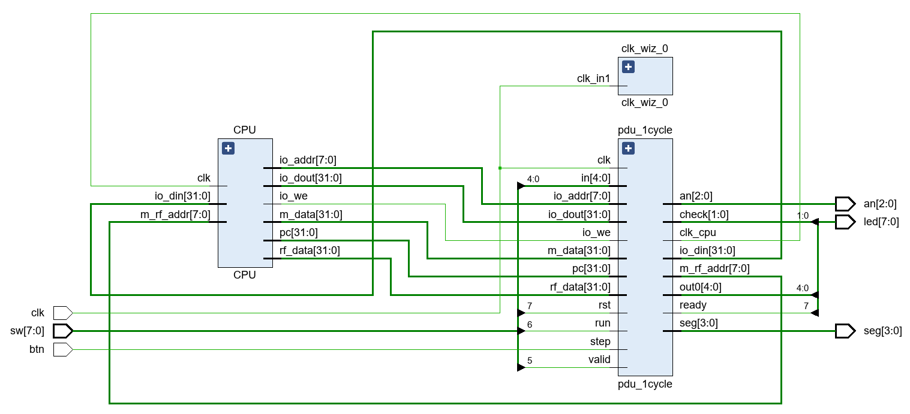

# Lab4_单周期CPU设计

## 一、实验题目

单周期CPU设计

## 二、实验目的

- 理解CPU的结构和工作原理
- 掌握单周期CPU的设计和调试方法
- 熟练掌握数据通路和控制器的设计和描述方法

## 三、实验平台

`Vivado`

## 四、实验过程与实验结果

### 1. 修改Lab2寄存器堆模块，增加1个用于调试的读端口，且使其r0内容恒定为0

`寄存器堆`模块的代码如下，增加了用于调试的读端口，地址和读出数据分别为`[4:0] dbg_addr`和`[31:0] dbg_out`,同时在写入时忽略对r0的写入，使r0内容恒为0

```verilog
module Registers(
    input clk,
    input [31:0] data_in,
    input [4:0] wr,
    input [4:0] r1,
    input [4:0] r2,
    input we,
    output [31:0] Reg1,
    output [31:0] Reg2,

    input [4:0] dbg_addr,
    output [31:0] dbg_out
);

reg [31:0] regfile[0:31];

integer i;
initial begin
    for (i = 0; i < 32; i = i + 1) regfile[i] = 0;
end

assign  Reg1 = regfile[r1],
        Reg2 = regfile[r2],
        dbg_out = regfile[dbg_addr];

always @(negedge clk) begin
    if (we && (wr != 0))  regfile[wr]  <=  data_in;
end

endmodule
```

### 2.结构化描述单周期CPU，并进行功能仿真

> 假定指令存储器和数据存储器（增加一个读端口用于调试）均使用分布式存储器，容量均为256x32位，使用Lab3实验内容2生成的COE文件(将测试指令由6条增加至10条)初始化

指令存储器的`分布式RAM`的配置如下


数据存储器的`分布式RAM`的配置如下


单周期CPU的结构化描述如下

- RTL通路

  

- CPU模块

  ```verilog
  module CPU(
      input clk,
  
      //IO_BUS
      output [7:0] io_addr,      //led和seg的地址
      output [31:0] io_dout,     //输出led和seg的数据
      output io_we,                 //输出led和seg数据时的使能信号
      input [31:0] io_din,          //来自sw的输入数据
  
      //Debug_BUS
      input [7:0] m_rf_addr,   //存储器(MEM)或寄存器堆(RF)的调试读口地址
      output [31:0] rf_data,    //从RF读取的数据
      output [31:0] m_data,    //从MEM读取的数据
      output [31:0] pc             //PC的内容
  );
  
  wire [31:0] PC_next;
  wire [31:0] PC_current;
  wire [31:0] instr;
  wire [4:0] wr;
  wire [4:0] r1;
  wire [4:0] r2;
  wire [5:0] optype;
  wire [31:0] imm;
  wire Reg_we;
  wire mux_1;
  wire mux_2;
  wire [4:0] ALU_ctrl;
  wire Data_Mem_we;
  wire [1:0] Reg_in_mux;
  wire  Branch_en;
  wire [2:0] Branch_type;
  wire Branch_uncond;
  wire [31:0] Reg_data_in;
  wire [31:0] Reg1;
  wire [31:0] Reg2;
  wire [31:0] op1;
  wire [31:0] op2;
  wire [31:0] result;
  wire taken;
  wire [31:0] Mem_data_out;
  
  PC PC(clk,PC_next,PC_current);
  PC_Mux PC_Mux(taken,Branch_en,Branch_uncond,result,PC_current + 32'd4,PC_next);
  Instr_memory Instr_memory(PC_current,instr);
  Decode Decode(instr,wr,r1,r2,optype);
  Imm Imm(optype,instr,imm);
  Control Control(optype,Reg_we,mux_1,mux_2,ALU_ctrl,Data_Mem_we,Reg_in_mux,Branch_en,Branch_type,Branch_uncond);
  Registers Registers(clk,Reg_data_in,wr,r1,r2,Reg_we,Reg1,Reg2,m_rf_addr[4:0],rf_data);
  Reg_Mux Reg_Mux(PC_current + 32'd4,result,Mem_data_out,Reg_in_mux,Reg_data_in);
  ALU ALU(op1,op2,ALU_ctrl,result);
  Branch Branch(Reg1,Reg2,Branch_type,taken);
  Data_Memory Data_Memory(clk,result,Reg2,Data_Mem_we,Mem_data_out,m_rf_addr,m_data,io_din);
  
  assign op1 = (mux_1) ? Reg1 : PC_current;
  assign op2 = (mux_2) ? imm : Reg2;
  
  assign pc = PC_current;
  assign io_addr = result[7:0];
  assign io_dout = Reg2;
  assign io_we = Data_Mem_we & (result[15:8] == 16'h04);
  
  endmodule
  ```

- PC模块

  实现对PC的下一个值的计算，包含PC+4与分支跳转

  ```verilog
  module PC_Mux(
      input taken,
      input Branch_en,
      input Branch_uncond,
      input [31:0] result,
      input [31:0] PC_4,
      output [31:0] PC_next
  );
  
  wire Branch;
  
  assign  Branch = (taken & Branch_en) | Branch_uncond,
          PC_next = (Branch) ? result : PC_4;
  
  endmodule
  
  module PC(
      input clk,
      input [31:0] next,
      output reg [31:0] current
  );
  
  initial begin
      current = 32'h3000 - 32'd4;
  end
  
  always @(posedge clk) begin
      if(next <= 32'h33FC)
          current <= next;
  end
  
  endmodule
  ```

- 指令存储器模块

  ```verilog
  module Instr_memory(
      input [31:0] addr,
      output [31:0] instr
  );
  
  wire [31:0] addr_true;
  
  assign addr_true = addr - 32'h3000;
  
  dist_mem_gen_0 dist_mem_gen_0(addr_true[9:2],instr);
  endmodule
  ```

- 译码器模块

  产生寄存器堆的`地址信号`与`optype信号`传递给控制模块和立即数模块

  ```verilog
  module Decode(
      input [31:0] instr,
      output reg [4:0] wr,
      output reg [4:0] r1,
      output reg [4:0] r2,
      output reg [5:0] optype
  );
  parameter ADD_SUB_OPCODE = 7'b0110011;
  parameter ADDI_OPCODE = 7'b0010011;
  parameter LW_OPCODE = 7'b0000011;
  parameter SW_OPCODE = 7'b0100011;
  parameter BEQ_BLT_OPCODE = 7'b1100011;
  parameter JAL_OPCODE = 7'b1101111;
  parameter AUIPC_OPCODE = 7'b0010111;
  parameter JALR_OPCODE = 7'b1100111;
  
  parameter ADD_FUNC7 = 7'b0000000;
  parameter SUB_FUNC7 = 7'b0100000;
  
  parameter BEQ_FUNC3 = 3'b000;
  parameter BLT_FUNC3 = 3'b100;
  
  parameter ADD_OPTYPE = 6'd0;
  parameter ADDI_OPTYPE = 6'd1;
  parameter LW_OPTYPE = 6'd2;
  parameter SW_OPTYPE = 6'd3;
  parameter BEQ_OPTYPE = 6'd4;
  parameter JAL_OPTYPE = 6'd5;
  parameter SUB_OPTYPE = 6'd6;
  parameter AUIPC_OPTYPE = 6'd7;
  parameter JALR_OPTYPE = 6'd8;
  parameter BLT_OPTYPE = 6'd9;
  
  wire [6:0] opcode;
  wire [6:0] func7;
  wire [2:0] func3;
  
  assign  opcode = instr[6:0],
          func7 = instr[31:25],
          func3 = instr[14:12];
  
  always @(*)begin
      case (opcode)
          ADD_SUB_OPCODE:begin
              case (func7)
                  ADD_FUNC7:begin
                      wr = instr[11:7];
                      r1 = instr[19:15];
                      r2 = instr[24:20];
                      optype = ADD_OPTYPE;
                  end
                  SUB_FUNC7:begin
                      wr = instr[11:7];
                      r1 = instr[19:15];
                      r2 = instr[24:20];
                      optype = SUB_OPTYPE;
                  end
                  default:begin
                      wr = 5'bz;
                      r1 = 5'bz;
                      r2 = 5'bz;
                      optype = 6'bz;
                  end
              endcase
          end
          ADDI_OPCODE:begin
              wr = instr[11:7];
              r1 = instr[19:15];
              r2 = 5'bz;
              optype = ADDI_OPTYPE;
          end
          LW_OPCODE:begin
              wr = instr[11:7];
              r1 = instr[19:15];
              r2 = 5'bz;
              optype = LW_OPTYPE;
          end
          SW_OPCODE:begin
              wr = 5'bz;
              r1 = instr[19:15];
              r2 = instr[24:20];
              optype = SW_OPTYPE;
          end
          BEQ_BLT_OPCODE:begin
              case (func3)
                  BEQ_FUNC3:begin
                      wr = 5'bz;
                      r1 = instr[19:15];
                      r2 = instr[24:20];
                      optype = BEQ_OPTYPE;
                  end
                  BLT_FUNC3:begin
                      wr = 5'bz;
                      r1 = instr[19:15];
                      r2 = instr[24:20];
                      optype = BLT_OPTYPE;
                  end
                  default:begin
                      wr = 5'bz;
                      r1 = 5'bz;
                      r2 = 5'bz;
                      optype = 6'bz;
                  end
              endcase
          end
          JAL_OPCODE:begin
              wr = instr[11:7];
              r1 = 5'bz;
              r2 = 5'bz;
              optype = JAL_OPTYPE;
          end
          AUIPC_OPCODE:begin
              wr = instr[11:7];
              r1 = 5'bz;
              r2 = 5'bz;
              optype = AUIPC_OPTYPE;
          end
          JALR_OPCODE:begin
              wr = instr[11:7];
              r1 = instr[19:15];
              r2 = 5'bz;
              optype = JALR_OPTYPE;
          end
          default:begin
              wr = 5'bz;
              r1 = 5'bz;
              r2 = 5'bz;
              optype = 6'bz;
          end
      endcase
  end
  
  endmodule
  ```

- 立即数模块

  根据`optype信号`，从指令中取出立即数并做符号拓展

  ```verilog
  module Imm(
      input [5:0] optype,
      input [31:0] instr,
      output reg [31:0] imm
  );
  parameter ADD_OPTYPE = 6'd0;
  parameter ADDI_OPTYPE = 6'd1;
  parameter LW_OPTYPE = 6'd2;
  parameter SW_OPTYPE = 6'd3;
  parameter BEQ_OPTYPE = 6'd4;
  parameter JAL_OPTYPE = 6'd5;
  parameter SUB_OPTYPE = 6'd6;
  parameter AUIPC_OPTYPE = 6'd7;
  parameter JALR_OPTYPE = 6'd8;
  parameter BLT_OPTYPE = 6'd9;
  
  always @(*)begin
      case (optype)
          ADD_OPTYPE,SUB_OPTYPE:begin
              imm = 32'bz;
          end
          ADDI_OPTYPE,LW_OPTYPE,JALR_OPTYPE:begin
              imm = $signed(instr[31:20]);
          end
          SW_OPTYPE:begin
              imm = $signed({instr[31:25],instr[11:7]});
          end
          BEQ_OPTYPE,BLT_OPTYPE:begin
              imm = $signed({instr[31],instr[7],instr[30:25],instr[11:8],1'b0});
          end
          JAL_OPTYPE:begin
              imm = $signed({instr[31],instr[19:12],instr[20],instr[30:21],1'b0});
          end
          AUIPC_OPTYPE:begin
              imm = $signed({instr[31:12],12'b0});
          end
          default:begin
              imm = 32'bz;
          end
      endcase
  end
  
  endmodule
  ```

- 控制模块

  产生寄存器堆和数据存储器的`写使能`信号，ALU的`控制信号`，各数据选择器的`选择信号`，`分支种类信号`，`分支使能信号`，`无条件跳转信号`

  ```verilog
  module Control(
      input [5:0] optype,
      output reg Reg_we,
      output reg mux_1,
      output reg mux_2,
      output reg [4:0] ALU_ctrl,
      output reg Data_Mem_we,
      output reg [1:0] Reg_in_mux,
      output reg Branch_en,
      output reg [2:0] Branch_type,
      output reg Branch_uncond
  );
  
  parameter ADD_OPTYPE = 6'd0;
  parameter ADDI_OPTYPE = 6'd1;
  parameter LW_OPTYPE = 6'd2;
  parameter SW_OPTYPE = 6'd3;
  parameter BEQ_OPTYPE = 6'd4;
  parameter JAL_OPTYPE = 6'd5;
  parameter SUB_OPTYPE = 6'd6;
  parameter AUIPC_OPTYPE = 6'd7;
  parameter JALR_OPTYPE = 6'd8;
  parameter BLT_OPTYPE = 6'd9;
  
  parameter PC_4 = 2'd0;
  parameter RESULT = 2'd1;
  parameter DATA = 2'd2;
  
  parameter BEQ_B = 3'd0;
  parameter BLT_B = 3'd1;
  
  parameter ADD_ALU = 5'd0;
  parameter SUB_ALU = 5'd1;
  
  always @(*)begin
      case (optype)
          ADD_OPTYPE:begin
              Reg_we = 1;
              mux_1 = 1;
              mux_2 = 0;
              ALU_ctrl = ADD_ALU;
              Data_Mem_we = 0;
              Reg_in_mux = RESULT;
              Branch_en = 0;
              Branch_type = 3'bz;
              Branch_uncond = 0;
          end
          ADDI_OPTYPE:begin
              Reg_we = 1;
              mux_1 = 1;
              mux_2 = 1;
              ALU_ctrl = ADD_ALU;
              Data_Mem_we = 0;
              Reg_in_mux = RESULT;
              Branch_en = 0;
              Branch_type = 3'bz;
              Branch_uncond = 0;
          end
          LW_OPTYPE:begin
              Reg_we = 1;
              mux_1 = 1;
              mux_2 = 1;
              ALU_ctrl = ADD_ALU;
              Data_Mem_we = 0;
              Reg_in_mux = DATA;
              Branch_en = 0;
              Branch_type = 3'bz;
              Branch_uncond = 0;
          end
          SW_OPTYPE:begin
              Reg_we = 0;
              mux_1 = 1;
              mux_2 = 1;
              ALU_ctrl = ADD_ALU;
              Data_Mem_we = 1;
              Reg_in_mux = 2'bz;
              Branch_en = 0;
              Branch_type = 3'bz;
              Branch_uncond = 0;
          end
          BEQ_OPTYPE:begin
              Reg_we = 0;
              mux_1 = 0;
              mux_2 = 1;
              ALU_ctrl = ADD_ALU;
              Data_Mem_we = 0;
              Reg_in_mux = 2'bz;
              Branch_en = 1;
              Branch_type = BEQ_B;
              Branch_uncond = 0;
          end
          JAL_OPTYPE:begin
              Reg_we = 1;
              mux_1 = 0;
              mux_2 = 1;
              ALU_ctrl = ADD_ALU;
              Data_Mem_we = 0;
              Reg_in_mux = PC_4;
              Branch_en = 0;
              Branch_type = 3'bz;
              Branch_uncond = 1;
          end
          SUB_OPTYPE:begin
              Reg_we = 1;
              mux_1 = 1;
              mux_2 = 0;
              ALU_ctrl = SUB_ALU;
              Data_Mem_we = 0;
              Reg_in_mux = RESULT;
              Branch_en = 0;
              Branch_type = 3'bz;
              Branch_uncond = 0;
          end
          AUIPC_OPTYPE:begin
              Reg_we = 1;
              mux_1 = 0;
              mux_2 = 1;
              ALU_ctrl = ADD_ALU;
              Data_Mem_we = 0;
              Reg_in_mux = RESULT;
              Branch_en = 0;
              Branch_type = 3'bz;
              Branch_uncond = 0;
          end
          JALR_OPTYPE:begin
              Reg_we = 1;
              mux_1 = 1;
              mux_2 = 1;
              ALU_ctrl = ADD_ALU;
              Data_Mem_we = 0;
              Reg_in_mux = PC_4;
              Branch_en = 0;
              Branch_type = 3'bz;
              Branch_uncond = 1;
          end
          BLT_OPTYPE:begin
              Reg_we = 0;
              mux_1 = 0;
              mux_2 = 1;
              ALU_ctrl = ADD_ALU;
              Data_Mem_we = 0;
              Reg_in_mux = 2'bz;
              Branch_en = 1;
              Branch_type = BLT_B;
              Branch_uncond = 0;
          end
          default:begin
              Reg_we = 0;
              mux_1 = 1'bz;
              mux_2 = 1'bz;
              ALU_ctrl = 5'bz;
              Data_Mem_we = 0;
              Reg_in_mux = 2'bz;
              Branch_en = 0;
              Branch_type = 3'bz;
              Branch_uncond = 0;
          end
      endcase
  end
  
  
  
  endmodule
  ```

- 寄存器堆模块

  (如前所述)

  ```verilog
  module Reg_Mux(
      input [31:0] pc_4,
      input [31:0] result,
      input [31:0] data_out,
      input [1:0] ctrl,
      output reg [31:0] data_in
  );
  parameter PC_4 = 2'd0;
  parameter RESULT = 2'd1;
  parameter DATA = 2'd2;
  
  always @(*) begin
      case (ctrl)
          PC_4:begin
              data_in = pc_4;
          end
          RESULT:begin
              data_in = result;
          end
          DATA:begin
              data_in = data_out;
          end
          default:begin
              data_in = pc_4;
          end
      endcase
  end
  
  endmodule
  
  module Registers(
      input clk,
      input [31:0] data_in,
      input [4:0] wr,
      input [4:0] r1,
      input [4:0] r2,
      input we,
      output [31:0] Reg1,
      output [31:0] Reg2,
  
      input [4:0] dbg_addr,
      output [31:0] dbg_out
  );
  
  reg [31:0] regfile[0:31];
  
  integer i;
  initial begin
      for (i = 0; i < 32; i = i + 1) regfile[i] = 0;
  end
  
  assign  Reg1 = regfile[r1],
          Reg2 = regfile[r2],
          dbg_out = regfile[dbg_addr];
  
  always @(negedge clk) begin
      if (we && (wr != 0))  regfile[wr]  <=  data_in;
  end
  
  endmodule
  ```

- ALU模块

  实现在控制信号下对加减的计算

  ```verilog
  module ALU(
      input [31:0] op1,
      input [31:0] op2,
      input [4:0] ctrl,
      output reg [31:0] result
  );
  
  parameter ADD_ALU = 5'd0;
  parameter SUB_ALU = 5'd1;
  
  always @(*) begin
      case (ctrl)
          ADD_ALU: result = op1 + op2;
          SUB_ALU: result = op1 - op2;
          default result = 32'bz; 
      endcase
  end
  
  endmodule
  ```

- 分支模块

  产生分支taken信号

  ```verilog
  module Branch(
      input [31:0] reg1,
      input [31:0] reg2,
      input [2:0] type,
      output reg taken
  );
  parameter BEQ_B = 3'd0;
  parameter BLT_B = 3'd1;
  
  always @(*)begin
      case (type)
          BEQ_B:begin
              taken = reg1 == reg2;
          end
          BLT_B:begin
              taken = reg1 < reg2;
          end
          default:begin
              taken = 0;
          end
      endcase
  end
  
  endmodule
  ```

- 数据存储器模块

  添加调试端口，增加对外部IO的映射

  ```verilog
  module Data_Memory(
      input clk,
      input [31:0] addr,
      input [31:0] data_in,
      input we,
      output [31:0] data_out,
  
      input [31:0] dbg_addr,
      output [31:0] dbg_out,
      input [31:0] io_din
  );
  
  wire [31:0] addr_true;
  wire [31:0] data_out_true;
  wire we_true;
  
  assign  addr_true = (addr <= 32'h03FC) ? addr : 32'dz,
          data_out = (addr[15:8] == 16'h04) ? io_din : data_out_true,
          we_true = (addr <= 32'h03FC) ? we : 0;
  
  dist_mem_gen_1 dist_mem_gen_1(addr_true[9:2],data_in,dbg_addr[9:2],~clk,we_true,data_out_true,dbg_out);
  
  endmodule
  ```

`单周期CPU`的`仿真文件`如下

```verilog
module CPU_test();
reg clk;
initial clk = 0;

initial begin
    repeat(50) #1 clk = ~clk;
    #5 $finish;
end

CPU CPU(clk);

endmodule
```

`单周期CPU`所用的`COE`文件的`RISCV`源码如下，在该文件中，实现了对全部10条指令的测试。（在RARS中，`lw`指令会被编译为`aupic`和`lw`指令）

```assembly
.data 
out: .word 0x00
in: .word 0x3000

.text 
lw t0 in
add t1 x0 t0
beq t1 t0 L2
L1:addi t1 t1 -1
sub t3 t1 t0
blt t3 x0 L3
L3: jal L4
L2: jalr t4, 16(t0)
L4: sw t1 out t2
```

仿真结果如下，可以看到第一个周期进行`auipc`，第二个周期使用`lw`载入`0x3000`到寄存器`t0`中，第三个周期使用`add`令`t1`的值为`0x3000`，第四个周期使用`beq`指令跳转到`L2`，第五个周期使用`jalr`跳转到`L1`，同时把`PC+4`存储在`t4`中，第六个周期使用`addi`使`t1`变成`0x2fff`，第七个周期使用`sub`使`t3`为`-1`，第八个周期使用`blt`跳转到`L3`，第九个周期使用`jal`跳转到`L4`，第十、十一个周期使用`sw`存储`t1`的值到数据段的`out`


另一斐波那契数列的`RISCV`源码如下，从仿真中可以看到，第一项和第二项为1和2，程序计算出了第10项的值为0x59

```assembly
.data 
out: .word 0x00
in: .word 10

.text
addi t1,x0,1
addi t2,x0,2
lw t3,in
beq t3,t1,SAVE12
beq t3,t2,SAVE12
addi t3,t3,-2
LOOP:add t0,x0,t1
add t1,x0,t2
add t2,t0,t1
addi t3,t3,-1
beq t3,x0,SAVE
jal LOOP
SAVE12: add t2,x0,t3
SAVE:sw t2,out,t4
```


### 3.将CPU和PDU下载至FPGA中测试，使用Lab3实验内容3生成的COE文件对指令存储器和数据存储器初始化

链接CPU和PDU的顶层模块如下

```verilog
module TOP(
    input clk,
    input btn,
    input [7:0] sw,
    output [7:0] led,
    output [2:0] an,
    output [3:0] seg
);

wire clk_cpu;
wire [7:0] io_addr; 
wire [31:0] io_dout;
wire io_we;
wire [31:0] io_din;
wire [7:0] m_rf_addr;
wire [31:0] rf_data;
wire [31:0] m_data;
wire [31:0] pc;

pdu_1cycle pdu_1cycle(
    .clk(clk),
    .an(an),
    .seg(seg),
    .rst(sw[7]),
    .run(sw[6]),
    .valid(sw[5]),
    .in(sw[4:0]),
    .ready(led[7]),
    .check(led[6:5]),
    .out0(led[4:0]),
    .step(btn),
    .clk_cpu(clk_cpu),
    .io_addr(io_addr),
    .io_dout(io_dout),
    .io_we(io_we),
    .io_din(io_din),
    .m_rf_addr(m_rf_addr),
    .rf_data(rf_data),
    .m_data(m_data),
    .pc(pc)
);

reg clk_r1,clk_r2;

always @(posedge clk)begin
    clk_r1 <= clk_cpu;
    clk_r2 <= clk_r1;
end

clk_wiz_0 clk_wiz_0(
    .clk_in1(clk),
    .clk_out1(clk_50)
);

wire real_clk;

assign real_clk = (sw[6]) ? clk_50 : (clk_r1 | clk_r2);

CPU CPU(
    .clk(clk_cpu),
    .io_addr(io_addr),
    .io_dout(io_dout),
    .io_we(io_we),
    .io_din(io_din),
    .m_rf_addr(m_rf_addr),
    .rf_data(rf_data),
    .m_data(m_data),
    .pc(pc)
);

endmodule

```

`RTL电路图`表示的`数据通路`如下



`约束文件`如下

```verilog
## This file is a general .xdc for FPGAOL_BOARD (adopted from Nexys4 DDR Rev. C)
## To use it in a project:
## - uncomment the lines corresponding to used pins
## - rename the used ports (in each line, after get_ports) according to the top level signal names in the project

# Clock signal
set_property -dict { PACKAGE_PIN E3    IOSTANDARD LVCMOS33 } [get_ports { clk }]; #IO_L12P_T1_MRCC_35 Sch=clk100mhz
create_clock -add -name sys_clk_pin -period 10.00 -waveform {0 5} [get_ports {clk}];


# FPGAOL LED (signle-digit-SEGPLAY)

set_property -dict { PACKAGE_PIN C17   IOSTANDARD LVCMOS33 } [get_ports { led[0] }];
set_property -dict { PACKAGE_PIN D18   IOSTANDARD LVCMOS33 } [get_ports { led[1] }];
set_property -dict { PACKAGE_PIN E18   IOSTANDARD LVCMOS33 } [get_ports { led[2] }];
set_property -dict { PACKAGE_PIN G17   IOSTANDARD LVCMOS33 } [get_ports { led[3] }];
set_property -dict { PACKAGE_PIN D17   IOSTANDARD LVCMOS33 } [get_ports { led[4] }];
set_property -dict { PACKAGE_PIN E17   IOSTANDARD LVCMOS33 } [get_ports { led[5] }];
set_property -dict { PACKAGE_PIN F18   IOSTANDARD LVCMOS33 } [get_ports { led[6] }];
set_property -dict { PACKAGE_PIN G18   IOSTANDARD LVCMOS33 } [get_ports { led[7] }];


# FPGAOL SWITCH

set_property -dict { PACKAGE_PIN D14   IOSTANDARD LVCMOS33 } [get_ports { sw[0] }];
set_property -dict { PACKAGE_PIN F16   IOSTANDARD LVCMOS33 } [get_ports { sw[1] }];
set_property -dict { PACKAGE_PIN G16   IOSTANDARD LVCMOS33 } [get_ports { sw[2] }];
set_property -dict { PACKAGE_PIN H14   IOSTANDARD LVCMOS33 } [get_ports { sw[3] }];
set_property -dict { PACKAGE_PIN E16   IOSTANDARD LVCMOS33 } [get_ports { sw[4] }];
set_property -dict { PACKAGE_PIN F13   IOSTANDARD LVCMOS33 } [get_ports { sw[5] }];
set_property -dict { PACKAGE_PIN G13   IOSTANDARD LVCMOS33 } [get_ports { sw[6] }];
set_property -dict { PACKAGE_PIN H16   IOSTANDARD LVCMOS33 } [get_ports { sw[7] }];


# FPGAOL HEXPLAY

set_property -dict { PACKAGE_PIN A14   IOSTANDARD LVCMOS33 } [get_ports { seg[0] }];
set_property -dict { PACKAGE_PIN A13   IOSTANDARD LVCMOS33 } [get_ports { seg[1] }];
set_property -dict { PACKAGE_PIN A16   IOSTANDARD LVCMOS33 } [get_ports { seg[2] }];
set_property -dict { PACKAGE_PIN A15   IOSTANDARD LVCMOS33 } [get_ports { seg[3] }];
set_property -dict { PACKAGE_PIN B17   IOSTANDARD LVCMOS33 } [get_ports { an[0] }];
set_property -dict { PACKAGE_PIN B16   IOSTANDARD LVCMOS33 } [get_ports { an[1] }];
set_property -dict { PACKAGE_PIN A18   IOSTANDARD LVCMOS33 } [get_ports { an[2] }];

## FPGAOL BUTTON & SOFT_CLOCK

set_property -dict { PACKAGE_PIN B18   IOSTANDARD LVCMOS33 } [get_ports { btn }];

##USB-RS232 Interface

#set_property -dict { PACKAGE_PIN C4    IOSTANDARD LVCMOS33 } [get_ports { UART_TXD_IN }]; #IO_L7P_T1_AD6P_35 Sch=uart_txd_in
#set_property -dict { PACKAGE_PIN D4    IOSTANDARD LVCMOS33 } [get_ports { UART_RXD_OUT }]; #IO_L11N_T1_SRCC_35 Sch=uart_rxd_out
#set_property -dict { PACKAGE_PIN D3    IOSTANDARD LVCMOS33 } [get_ports { UART_CTS }]; #IO_L12N_T1_MRCC_35 Sch=uart_cts
#set_property -dict { PACKAGE_PIN E5    IOSTANDARD LVCMOS33 } [get_ports { UART_RTS }]; #IO_L5N_T0_AD13N_35 Sch=uart_rts
```

`下载测试`如下，`COE`文件的`RISCV`源码如前所述，下图按先从左到右后从上到下依次为：`复位`状态、执行`lw`后的寄存器`t0`，执行`add`后的寄存器`t1`，执行`beq`后的`PC`，执行`jalr`后的`PC`，执行`addi`后的寄存器`t1`，执行`sub`后的寄存器`t3`，执行`blt`后的`PC`，执行`jal`后的`PC`，执行`sw`后的数据存储器的`out`


下图为斐波那契程序计算出的第十项的值0x59


### 4.应用程序测试（选做）

​	使用提供的计算斐波那契数列的程序进行测试，下图按先从左到右后从上到下依次为：

- 程序开始运行等待输入
- valid有效输入第一项为1
- valid无效、ready有效
- valid有效、ready无效输入第二项为2
- valid无效、ready有效、计算出下一项为3
- valid有效、ready无效
- valid无效、ready有效、计算出下一项为5
- valid有效、ready无效


从图中可以看到，通过握手信号(valid-ready)，采用全互锁模式协调CPU和外设的数据传输过程，valid和ready依次变换

## 五、心得体会

​	通过这次实验了解了`CPU的结构和工作原理`、熟练掌握`单周期CPU的设计和调试方法`、`数据通路和控制器的设计和描述方法`。
