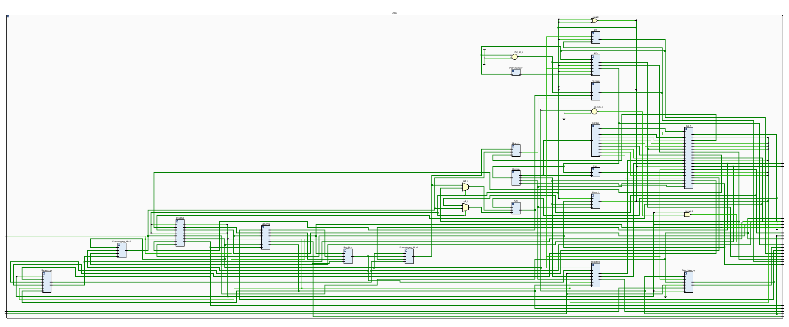
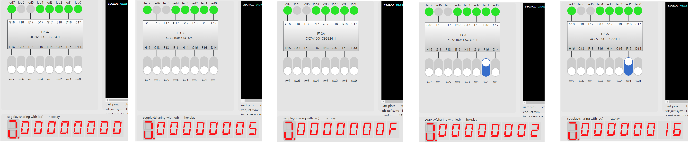
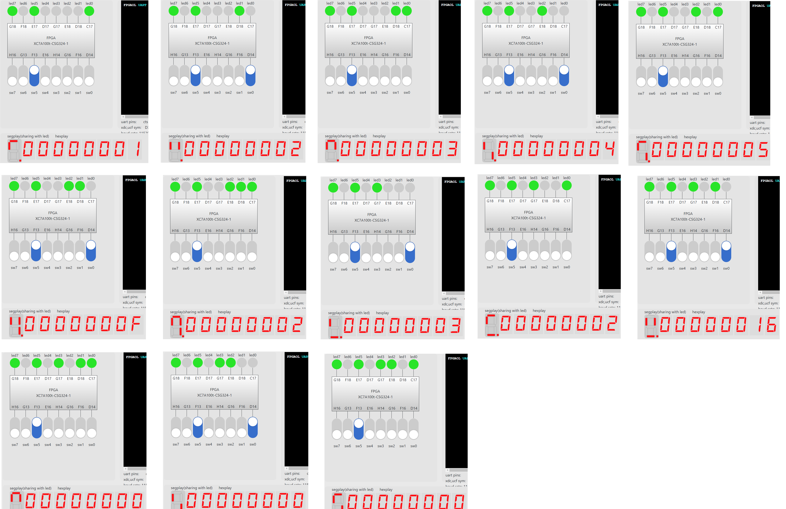
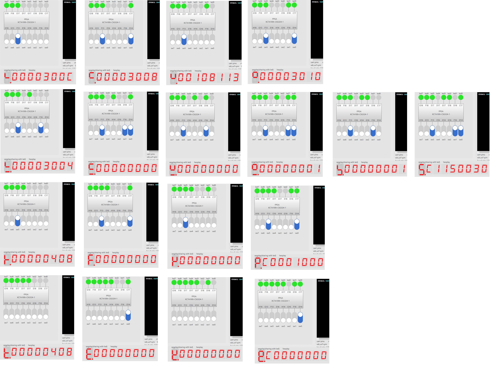

# Lab5_流水线CPU设计

## 一、实验题目

流水线CPU设计

## 二、实验目的

- 理解流水线CPU的结构和工作原理
- 掌握流水线CPU的设计和调试方法，特别是流水线中数据相关和控制相关的处理
- 熟练掌握数据通路和控制器的设计和描述方法

## 三、实验平台

`Vivado`

## 四、实验过程与实验结果

### 1. 修改Lab4寄存器堆模块，使其满足写优先(Write First)，即在对同一寄存器读写时，写数据可立即从读数据输出

`寄存器堆`模块的代码如下，在读出数据时增加了判断以满足写优先，当读取的寄存器与下一周期写入的寄存器相同时，将即将写入的值直接输出

```verilog
module Registers(
    input clk,
    input [31:0] data_in,
    input [4:0] wr,
    input [4:0] r1,
    input [4:0] r2,
    input we,
    output [31:0] Reg1,
    output [31:0] Reg2,

    input [4:0] dbg_addr,
    output [31:0] dbg_out
);

reg [31:0] regfile[0:31];

integer i;
initial begin
    for (i = 0; i < 32; i = i + 1) regfile[i] = 0;
end

assign  Reg1 = (we && (wr == r1)) ? data_in : regfile[r1],
        Reg2 = (we && (wr == r2)) ? data_in : regfile[r2],
        dbg_out = regfile[dbg_addr];

always @(posedge clk) begin
    if (we && (wr != 0))  regfile[wr]  <=  data_in;
end

endmodule
```

### 2.设计完整的流水线CPU

流水线CPU的结构化描述如下

- RTL通路

  

- CPU模块

  与单周期CPU相比，加入了四个段间寄存器`IFID`、`IDEX`、`EXMEM`、`MEMWB`，前递模块`Forwarding`与两个前递选择寄存器`Forwaringreg_Mux`、冒险检测模块`Hazard`，加入了输出段间寄存器到`PDU`的一系列端口

  ```verilog
  module CPU(
      input clk,
  
      //IO_BUS
      output [7:0] io_addr,      //led和seg的地址
      output [31:0] io_dout,     //输出led和seg的数据
      output io_we,                 //输出led和seg数据时的使能信号
      input [31:0] io_din,          //来自sw的输入数据
  
      //Debug_BUS
      input [7:0] m_rf_addr,   //存储器(MEM)或寄存器堆(RF)的调试读口地址
      output [31:0] rf_data,    //从RF读取的数据
      output [31:0] m_data,    //从MEM读取的数据
  
      //PC/IF/ID 流水段寄存器
      output [31:0] pc,
      output [31:0] pcd,
      output [31:0] ir,
      output [31:0] pcin,
  
      // ID/EX 流水段寄存器
      output [31:0] pce,
      output [31:0] a,
      output [31:0] b,
      output [31:0] imm_,
      output [4:0] rd,
      output [31:0] ctrl,
  
      // EX/MEM 流水段寄存器
      output [31:0] y,
      output [31:0] bm,
      output [4:0] rdm,
      output [31:0] ctrlm,
  
      // MEM/WB 流水段寄存器
      output [31:0] yw,
      output [31:0] mdr,
      output [4:0] rdw,
      output [31:0] ctrlw
  
  
  );
  
  wire [31:0] PC_next;
  wire [31:0] PC_current;
  wire [31:0] instr;
  wire [4:0] wr;
  wire [4:0] r1;
  wire [4:0] r2;
  wire [5:0] optype;
  wire [31:0] imm;
  wire Reg_we;
  wire mux_1;
  wire mux_2;
  wire [4:0] ALU_ctrl;
  wire Data_Mem_we;
  wire [1:0] Reg_in_mux;
  wire  Branch_en;
  wire [2:0] Branch_type;
  wire Branch_uncond;
  wire Mem_read;
  wire [31:0] Reg_data_in;
  wire [31:0] Reg1;
  wire [31:0] Reg2;
  wire [31:0] op1;
  wire [31:0] op2;
  wire [31:0] result;
  wire taken;
  wire [31:0] Mem_data_out;
  
  wire clear;
  wire [31:0] IFID_PC_4;
  wire [31:0] IFID_PC;
  wire [31:0] IFID_instr;
  wire IDEX_Reg_we;
  wire IDEX_mux_1;
  wire IDEX_mux_2;
  wire [4:0] IDEX_ALU_ctrl;
  wire IDEX_Data_Mem_we;
  wire [1:0] IDEX_Reg_in_mux;
  wire IDEX_Branch_en;
  wire [2:0] IDEX_Branch_type;
  wire IDEX_Branch_uncond;
  wire IDEX_Mem_read;
  wire [31:0] IDEX_PC_4;
  wire [31:0] IDEX_PC;
  wire [31:0] IDEX_Reg1;
  wire [31:0] IDEX_Reg2;
  wire [31:0] IDEX_imm;
  wire [4:0] IDEX_wr;
  wire [4:0] IDEX_r1;
  wire [4:0] IDEX_r2;
  wire EXMEM_Reg_we;
  wire EXMEM_Data_Mem_we;
  wire [1:0] EXMEM_Reg_in_mux;
  wire [31:0] EXMEM_PC_4;
  wire [31:0] EXMEM_result;
  wire [31:0] EXMEM_Reg2;
  wire [4:0] EXMEM_wr;
  wire MEMWB_Reg_we;
  wire [1:0] MEMWB_Reg_in_mux;
  wire [31:0] MEMWB_PC_4;
  wire [31:0] MEMWB_result;
  wire [31:0] MEMWB_Mem_data_out;
  wire [4:0] MEMWB_wr;
  
  wire [1:0] forwardingreg1_mux;
  wire [1:0] forwardingreg2_mux;
  wire [31:0] Forwaringreg_Reg1;
  wire [31:0] Forwaringreg_Reg2;
  
  wire hazard_enable;
  
  PC PC(clk,hazard_enable,PC_next,PC_current);
  PC_Mux PC_Mux(taken,IDEX_Branch_en,IDEX_Branch_uncond,result,PC_current + 32'd4,PC_next,clear);
  Instr_memory Instr_memory(PC_current,instr);
  Decode Decode(IFID_instr,wr,r1,r2,optype);
  Imm Imm(optype,IFID_instr,imm);
  Control Control(optype,Reg_we,mux_1,mux_2,ALU_ctrl,Data_Mem_we,Reg_in_mux,Branch_en,Branch_type,Branch_uncond,Mem_read);
  Registers Registers(clk,Reg_data_in,MEMWB_wr,r1,r2,MEMWB_Reg_we,Reg1,Reg2,m_rf_addr[4:0],rf_data);
  Reg_Mux Reg_Mux(MEMWB_PC_4,MEMWB_result,MEMWB_Mem_data_out,MEMWB_Reg_in_mux,Reg_data_in);
  ALU ALU(op1,op2,IDEX_ALU_ctrl,result);
  Branch Branch(Forwaringreg_Reg1,Forwaringreg_Reg2,IDEX_Branch_type,taken);
  Data_Memory Data_Memory(clk,EXMEM_result,EXMEM_Reg2,EXMEM_Data_Mem_we,Mem_data_out,m_rf_addr,m_data,io_din);
  
  IFID IFID(clk,clear,hazard_enable,PC_current + 32'd4,PC_current,instr,IFID_PC_4,IFID_PC,IFID_instr);
  IDEX IDEX(clk,~hazard_enable | clear,Reg_we,mux_1,mux_2,ALU_ctrl,Data_Mem_we,Reg_in_mux,Branch_en,Branch_type,Branch_uncond,Mem_read,IFID_PC_4,IFID_PC,Reg1,Reg2,imm,wr,r1,r2,
  IDEX_Reg_we,IDEX_mux_1,IDEX_mux_2,IDEX_ALU_ctrl,IDEX_Data_Mem_we,IDEX_Reg_in_mux,IDEX_Branch_en,IDEX_Branch_type,IDEX_Branch_uncond,IDEX_Mem_read,IDEX_PC_4,IDEX_PC,IDEX_Reg1,IDEX_Reg2,IDEX_imm,IDEX_wr,IDEX_r1,IDEX_r2);
  EXMEM EXMEM(clk,IDEX_Reg_we,IDEX_Data_Mem_we,IDEX_Reg_in_mux,IDEX_PC_4,result,Forwaringreg_Reg2,IDEX_wr,EXMEM_Reg_we,EXMEM_Data_Mem_we,EXMEM_Reg_in_mux,EXMEM_PC_4,EXMEM_result,EXMEM_Reg2,EXMEM_wr);
  MEMWB MEMWB(clk,EXMEM_Reg_we,EXMEM_Reg_in_mux,EXMEM_PC_4,EXMEM_result,Mem_data_out,EXMEM_wr,MEMWB_Reg_we,MEMWB_Reg_in_mux,MEMWB_PC_4,MEMWB_result,MEMWB_Mem_data_out,MEMWB_wr);
  
  Forwarding Forwarding(IDEX_r1,IDEX_r2,EXMEM_Reg_we,EXMEM_wr,MEMWB_Reg_we,MEMWB_wr,forwardingreg1_mux,forwardingreg2_mux);
  Forwaringreg_Mux Forwaringreg_Mux1(Reg_data_in,IDEX_Reg1,EXMEM_result,forwardingreg1_mux,Forwaringreg_Reg1);
  Forwaringreg_Mux Forwaringreg_Mux2(Reg_data_in,IDEX_Reg2,EXMEM_result,forwardingreg2_mux,Forwaringreg_Reg2);
  
  Hazard Hazard(IDEX_Mem_read,IDEX_wr,r1,r2,hazard_enable);
  
  assign  op1 = (IDEX_mux_1) ? Forwaringreg_Reg1 : IDEX_PC,
          op2 = (IDEX_mux_2) ? IDEX_imm : Forwaringreg_Reg2;
  
  assign  io_addr = EXMEM_result[7:0],
          io_dout = EXMEM_Reg2,
          io_we = EXMEM_Data_Mem_we & (EXMEM_result[15:8] == 16'h04);
  
  assign  pc = PC_current,
          pcd = IFID_PC,
          ir = IFID_instr,
          pcin = PC_next,
          pce = IDEX_PC,
          a = IDEX_Reg1,
          b = IDEX_Reg2,
          imm_ = IDEX_imm,
          rd = IDEX_wr,
          ctrl =  {hazard_enable,hazard_enable,clear,~hazard_enable | clear,2'b0,forwardingreg1_mux,2'b0,forwardingreg2_mux,1'b0,IDEX_Reg_we,IDEX_Reg_in_mux,
                  2'b0,IDEX_Mem_read,IDEX_Data_Mem_we,2'b0,IDEX_Branch_uncond,IDEX_Branch_en,2'b0,IDEX_mux_1,IDEX_mux_2,IDEX_ALU_ctrl[3:0]},
          y = EXMEM_result,
          bm = EXMEM_Reg2,
          rdm = EXMEM_wr,
          ctrlm = {hazard_enable,hazard_enable,clear,~hazard_enable | clear,2'b0,2'b0,2'b0,2'b0,1'b0,EXMEM_Reg_we,EXMEM_Reg_in_mux,
                  2'b0,1'b0,EXMEM_Data_Mem_we,2'b0,1'b0,1'b0,2'b0,1'b0,1'b0,4'b0},
          yw = MEMWB_result,
          mdr = Mem_data_out,
          rdw = MEMWB_wr,
          ctrlw = {hazard_enable,hazard_enable,clear,~hazard_enable | clear,2'b0,2'b0,2'b0,2'b0,1'b0,MEMWB_Reg_we,MEMWB_Reg_in_mux,
                  2'b0,1'b0,1'b0,2'b0,1'b0,1'b0,2'b0,1'b0,1'b0,4'b0};
  endmodule
  ```

- IFID模块

  寄存IF/ID间的`PC+4`、`PC`、`instr(指令)`，`clear`和`enable`分别为清空和使能信号，`clear`用于在静态分支预测失败时清除段间寄存器，`enable`用于在出现`load`相关冒险时停顿流水线

  ```verilog
  module IFID(
      input clk,
      input clear,
      input enable,
      input [31:0] PC_4,
      input [31:0] PC,
      input [31:0] instr,
      output reg [31:0] IFID_PC_4,
      output reg [31:0] IFID_PC,
      output reg [31:0] IFID_instr
  );
  
  initial begin
      IFID_PC_4 <= 0;
      IFID_PC <= 0;
      IFID_instr <= 0;
  end
  
  always @(posedge clk)begin
      if(clear) begin
          IFID_PC_4 <= 0;
          IFID_PC <= 0;
          IFID_instr <= 0;
      end
      else if(enable) begin
          IFID_PC_4 <= PC_4;
          IFID_PC <= PC;
          IFID_instr <= instr;
      end
  end
  
  endmodule
  ```

- IDEX模块

  寄存ID/EX间的`控制信号`、`PC+4`、`PC`、`寄存器输出`、`立即数`、`读写寄存器编号`，`clear`为清空信号，用于在静态分支预测失败时清除段间寄存器

  ```verilog
  module IDEX(
      input clk,
      input clear,
      input Reg_we,
      input mux_1,
      input mux_2,
      input [4:0] ALU_ctrl,
      input Data_Mem_we,
      input [1:0] Reg_in_mux,
      input Branch_en,
      input [2:0] Branch_type,
      input Branch_uncond,
      input Mem_read,
      input [31:0] PC_4,
      input [31:0] PC,
      input [31:0] Reg1,
      input [31:0] Reg2,
      input [31:0] imm,
      input [4:0] wr,
      input [4:0] r1,
      input [4:0] r2,
      output reg IDEX_Reg_we,
      output reg IDEX_mux_1,
      output reg IDEX_mux_2,
      output reg [4:0] IDEX_ALU_ctrl,
      output reg IDEX_Data_Mem_we,
      output reg [1:0] IDEX_Reg_in_mux,
      output reg IDEX_Branch_en,
      output reg [2:0] IDEX_Branch_type,
      output reg IDEX_Branch_uncond,
      output reg IDEX_Mem_read,
      output reg [31:0] IDEX_PC_4,
      output reg [31:0] IDEX_PC,
      output reg [31:0] IDEX_Reg1,
      output reg [31:0] IDEX_Reg2,
      output reg [31:0] IDEX_imm,
      output reg [4:0] IDEX_wr,
      output reg [4:0] IDEX_r1,
      output reg [4:0] IDEX_r2
  );
  
  initial begin
      IDEX_Reg_we <= 0;
      IDEX_mux_1 <= 0;
      IDEX_mux_2 <= 0;
      IDEX_ALU_ctrl <= 0;
      IDEX_Data_Mem_we <= 0;
      IDEX_Reg_in_mux <= 0;
      IDEX_Branch_en <= 0;
      IDEX_Branch_type <= 0;
      IDEX_Branch_uncond <= 0;
      IDEX_Mem_read <= 0;
      IDEX_PC_4 <= 0;
      IDEX_PC <= 0;
      IDEX_Reg1 <= 0;
      IDEX_Reg2 <= 0;
      IDEX_imm <= 0;
      IDEX_wr <= 0;
      IDEX_r1 <= 0;
      IDEX_r2 <= 0;
  end
  
  always @(posedge clk) begin
      if(clear) begin
          IDEX_Reg_we <= 0;
          IDEX_mux_1 <= 0;
          IDEX_mux_2 <= 0;
          IDEX_ALU_ctrl <= 0;
          IDEX_Data_Mem_we <= 0;
          IDEX_Reg_in_mux <= 0;
          IDEX_Branch_en <= 0;
          IDEX_Branch_type <= 0;
          IDEX_Branch_uncond <= 0;
          IDEX_Mem_read <= 0;
          IDEX_PC_4 <= 0;
          IDEX_PC <= 0;
          IDEX_Reg1 <= 0;
          IDEX_Reg2 <= 0;
          IDEX_imm <= 0;
          IDEX_wr <= 0;
          IDEX_r1 <= 0;
          IDEX_r2 <= 0;
      end
      else begin
          IDEX_Reg_we <= Reg_we;
          IDEX_mux_1 <= mux_1;
          IDEX_mux_2 <= mux_2;
          IDEX_ALU_ctrl <= ALU_ctrl;
          IDEX_Data_Mem_we <= Data_Mem_we;
          IDEX_Reg_in_mux <= Reg_in_mux;
          IDEX_Branch_en <= Branch_en;
          IDEX_Branch_type <= Branch_type;
          IDEX_Branch_uncond <= Branch_uncond;
          IDEX_Mem_read <= Mem_read;
          IDEX_PC_4 <= PC_4;
          IDEX_PC <= PC;
          IDEX_Reg1 <= Reg1;
          IDEX_Reg2 <= Reg2;
          IDEX_imm <= imm;
          IDEX_wr <= wr;
          IDEX_r1 <= r1;
          IDEX_r2 <= r2;
      end
  end
  
  endmodule
  ```

- EXMEM模块

  寄存EX/MEM间的`控制信号`、`PC+4`、`ALU输出`、`寄存器2输出`、`写寄存器编号`

  ```verilog
  module EXMEM(
      input clk,
      input Reg_we,
      input Data_Mem_we,
      input [1:0] Reg_in_mux,
      input [31:0] PC_4,
      input [31:0] result,
      input [31:0] Reg2,
      input [4:0] wr,
      output reg EXMEM_Reg_we,
      output reg EXMEM_Data_Mem_we,
      output reg [1:0] EXMEM_Reg_in_mux,
      output reg [31:0] EXMEM_PC_4,
      output reg [31:0] EXMEM_result,
      output reg [31:0] EXMEM_Reg2,
      output reg [4:0] EXMEM_wr
  );
  
  initial begin
      EXMEM_Reg_we <= 0;
      EXMEM_Data_Mem_we <= 0;
      EXMEM_Reg_in_mux <= 0;
      EXMEM_PC_4 <= 0;
      EXMEM_result <= 0;
      EXMEM_Reg2 <= 0;
      EXMEM_wr <= 0;
  end
  
  always @(posedge clk) begin
      EXMEM_Reg_we <= Reg_we;
      EXMEM_Data_Mem_we <= Data_Mem_we;
      EXMEM_Reg_in_mux <= Reg_in_mux;
      EXMEM_PC_4 <= PC_4;
      EXMEM_result <= result;
      EXMEM_Reg2 <= Reg2;
      EXMEM_wr <= wr;
  end
  
  endmodule
  ```
  
- MEMWB模块

  寄存MEM/WB间的`控制信号`、`PC+4`、`ALU输出`、`数据存储器输出`、`写寄存器编号`

  ```verilog
  module MEMWB(
      input clk,
      input Reg_we,
      input [1:0] Reg_in_mux,
      input [31:0] PC_4,
      input [31:0] result,
      input [31:0] Mem_data_out,
      input [4:0] wr,
      output reg MEMWB_Reg_we,
      output reg [1:0] MEMWB_Reg_in_mux,
      output reg [31:0] MEMWB_PC_4,
      output reg [31:0] MEMWB_result,
      output reg [31:0] MEMWB_Mem_data_out,
      output reg [4:0] MEMWB_wr
  );
  
  initial begin
      MEMWB_Reg_we <= 0;
      MEMWB_Reg_in_mux <= 0;
      MEMWB_PC_4 <= 0;
      MEMWB_result <= 0;
      MEMWB_Mem_data_out <= 0;
      MEMWB_wr <= 0;
  end
  
  always @(posedge clk) begin
      MEMWB_Reg_we <= Reg_we;
      MEMWB_Reg_in_mux <= Reg_in_mux;
      MEMWB_PC_4 <= PC_4;
      MEMWB_result <= result;
      MEMWB_Mem_data_out <= Mem_data_out;
      MEMWB_wr <= wr;
  end
  
  endmodule
  ```
  
- 前递模块与前递数据选择器

  前递模块判断在`MEM`、`WB`阶段和`EX`阶段间可能产生的数据冒险，判断条件是`MEM`或`WB`阶段寄存器写使能有效，且写寄存器不为`x0`且与`EX`阶段的寄存器编号相同，产生的控制信号传递到前递数据选择器

  ```verilog
  module Forwaringreg_Mux(
      input [31:0] MEMWB_Reg_data_in,
      input [31:0] Reg,
      input [31:0] EXMEM_result,
      input [1:0] forwardingreg,
      output reg [31:0] Reg_out
  );
  
  parameter MEMWB = 2'b00;
  parameter Register = 2'b01;
  parameter EXMEM = 2'b10;
  
  always @(*) begin
      case (forwardingreg)
          MEMWB: Reg_out = MEMWB_Reg_data_in;
          Register: Reg_out = Reg;
          EXMEM: Reg_out = EXMEM_result;
          default: Reg_out = Reg;
      endcase
  end
  
  endmodule
  
  module Forwarding(
      input [4:0] IDEX_r1,
      input [4:0] IDEX_r2,
      input EXMEM_Reg_we,
      input [4:0] EXMEM_wr,
      input MEMWB_Reg_we,
      input [4:0] MEMWB_wr,
      output reg [1:0] forwardingreg1_mux,
      output reg [1:0] forwardingreg2_mux
  );
  
  parameter MEMWB = 2'b00;
  parameter Register = 2'b01;
  parameter EXMEM = 2'b10;
  
  always @(*) begin
      if(EXMEM_Reg_we && IDEX_r1 == EXMEM_wr && EXMEM_wr != 0) begin
          forwardingreg1_mux = EXMEM;
      end
      else if(MEMWB_Reg_we && IDEX_r1 == MEMWB_wr && MEMWB_wr != 0) begin
          forwardingreg1_mux = MEMWB;
      end
      else begin
          forwardingreg1_mux = Register;
      end
  end
  
  always @(*) begin
      if(EXMEM_Reg_we && IDEX_r2 == EXMEM_wr && EXMEM_wr != 0) begin
          forwardingreg2_mux = EXMEM;
      end
      else if(MEMWB_Reg_we && IDEX_r2 == MEMWB_wr && MEMWB_wr != 0) begin
          forwardingreg2_mux = MEMWB;
      end
      else begin
          forwardingreg2_mux = Register;
      end
  end
  
  endmodule
  ```
  
- 冒险处理模块

  当出现load相关的冒险时，产生控制信号，判断条件是`IDEX`寄存器的数据存储器读使能有效，写寄存器与读寄存器相同

  ```verilog
  module Hazard(
      input IDEX_Mem_read,
      input [4:0] IDEX_wr,
      input [4:0] r1,
      input [4:0] r2,
      output reg hazard_enable
  );
  
  always @(*) begin
      if(IDEX_Mem_read && (IDEX_wr == r1 || IDEX_wr == r2))
          hazard_enable = 0;
      else
          hazard_enable = 1;
  end
  
  endmodule
  ```

链接CPU和PDU的顶层模块如下

```verilog
module TOP(
    input clk,
    input btn,
    input [7:0] sw,
    output [7:0] led,
    output [2:0] an,
    output [3:0] seg
);

wire clk_cpu;
wire [7:0] io_addr; 
wire [31:0] io_dout;
wire io_we;
wire [31:0] io_din;
wire [7:0] m_rf_addr;
wire [31:0] rf_data;
wire [31:0] m_data;

wire [31:0] pcin, pc, pcd, pce;
wire [31:0] ir, imm, mdr;
wire [31:0] a, b, y, bm, yw;
wire [4:0]  rd, rdm, rdw;
wire [31:0] ctrl, ctrlm, ctrlw;

pdu pdu(
    .clk(clk),
    .an(an),
    .seg(seg),
    .rst(sw[7]),
    .run(sw[6]),
    .valid(sw[5]),
    .in(sw[4:0]),
    .ready(led[7]),
    .check(led[6:5]),
    .out0(led[4:0]),
    .step(btn),
    .clk_cpu(clk_cpu),
    .io_addr(io_addr),
    .io_dout(io_dout),
    .io_we(io_we),
    .io_din(io_din),
    .m_rf_addr(m_rf_addr),
    .rf_data(rf_data),
    .m_data(m_data),
    .pcin(pcin),
    .pc(pc),
    .pcd(pcd),
    .pce(pce),
    .ir(ir),
    .imm(imm),
    .mdr(mdr),
    .a(a),
    .b(b),
    .y(y),
    .bm(bm),
    .yw(yw),
    .rd(rd),
    .rdm(rdm),
    .rdw(rdw),
    .ctrl(ctrl),
    .ctrlm(ctrlm),
    .ctrlw(ctrlw)
);

CPU CPU(
    .clk(clk_cpu),
    .io_addr(io_addr),
    .io_dout(io_dout),
    .io_we(io_we),
    .io_din(io_din),
    .m_rf_addr(m_rf_addr),
    .rf_data(rf_data),
    .m_data(m_data),
    .pcin(pcin),
    .pc(pc),
    .pcd(pcd),
    .pce(pce),
    .ir(ir),
    .imm_(imm),
    .mdr(mdr),
    .a(a),
    .b(b),
    .y(y),
    .bm(bm),
    .yw(yw),
    .rd(rd),
    .rdm(rdm),
    .rdw(rdw),
    .ctrl(ctrl),
    .ctrlm(ctrlm),
    .ctrlw(ctrlw)
);

endmodule
```

`约束文件`如下

```verilog
## This file is a general .xdc for FPGAOL_BOARD (adopted from Nexys4 DDR Rev. C)
## To use it in a project:
## - uncomment the lines corresponding to used pins
## - rename the used ports (in each line, after get_ports) according to the top level signal names in the project

# Clock signal
set_property -dict { PACKAGE_PIN E3    IOSTANDARD LVCMOS33 } [get_ports { clk }]; #IO_L12P_T1_MRCC_35 Sch=clk100mhz
create_clock -add -name sys_clk_pin -period 10.00 -waveform {0 5} [get_ports {clk}];


# FPGAOL LED (signle-digit-SEGPLAY)

set_property -dict { PACKAGE_PIN C17   IOSTANDARD LVCMOS33 } [get_ports { led[0] }];
set_property -dict { PACKAGE_PIN D18   IOSTANDARD LVCMOS33 } [get_ports { led[1] }];
set_property -dict { PACKAGE_PIN E18   IOSTANDARD LVCMOS33 } [get_ports { led[2] }];
set_property -dict { PACKAGE_PIN G17   IOSTANDARD LVCMOS33 } [get_ports { led[3] }];
set_property -dict { PACKAGE_PIN D17   IOSTANDARD LVCMOS33 } [get_ports { led[4] }];
set_property -dict { PACKAGE_PIN E17   IOSTANDARD LVCMOS33 } [get_ports { led[5] }];
set_property -dict { PACKAGE_PIN F18   IOSTANDARD LVCMOS33 } [get_ports { led[6] }];
set_property -dict { PACKAGE_PIN G18   IOSTANDARD LVCMOS33 } [get_ports { led[7] }];


# FPGAOL SWITCH

set_property -dict { PACKAGE_PIN D14   IOSTANDARD LVCMOS33 } [get_ports { sw[0] }];
set_property -dict { PACKAGE_PIN F16   IOSTANDARD LVCMOS33 } [get_ports { sw[1] }];
set_property -dict { PACKAGE_PIN G16   IOSTANDARD LVCMOS33 } [get_ports { sw[2] }];
set_property -dict { PACKAGE_PIN H14   IOSTANDARD LVCMOS33 } [get_ports { sw[3] }];
set_property -dict { PACKAGE_PIN E16   IOSTANDARD LVCMOS33 } [get_ports { sw[4] }];
set_property -dict { PACKAGE_PIN F13   IOSTANDARD LVCMOS33 } [get_ports { sw[5] }];
set_property -dict { PACKAGE_PIN G13   IOSTANDARD LVCMOS33 } [get_ports { sw[6] }];
set_property -dict { PACKAGE_PIN H16   IOSTANDARD LVCMOS33 } [get_ports { sw[7] }];


# FPGAOL HEXPLAY

set_property -dict { PACKAGE_PIN A14   IOSTANDARD LVCMOS33 } [get_ports { seg[0] }];
set_property -dict { PACKAGE_PIN A13   IOSTANDARD LVCMOS33 } [get_ports { seg[1] }];
set_property -dict { PACKAGE_PIN A16   IOSTANDARD LVCMOS33 } [get_ports { seg[2] }];
set_property -dict { PACKAGE_PIN A15   IOSTANDARD LVCMOS33 } [get_ports { seg[3] }];
set_property -dict { PACKAGE_PIN B17   IOSTANDARD LVCMOS33 } [get_ports { an[0] }];
set_property -dict { PACKAGE_PIN B16   IOSTANDARD LVCMOS33 } [get_ports { an[1] }];
set_property -dict { PACKAGE_PIN A18   IOSTANDARD LVCMOS33 } [get_ports { an[2] }];

## FPGAOL BUTTON & SOFT_CLOCK

set_property -dict { PACKAGE_PIN B18   IOSTANDARD LVCMOS33 } [get_ports { btn }];

##USB-RS232 Interface

#set_property -dict { PACKAGE_PIN C4    IOSTANDARD LVCMOS33 } [get_ports { UART_TXD_IN }]; #IO_L7P_T1_AD6P_35 Sch=uart_txd_in
#set_property -dict { PACKAGE_PIN D4    IOSTANDARD LVCMOS33 } [get_ports { UART_RXD_OUT }]; #IO_L11N_T1_SRCC_35 Sch=uart_rxd_out
#set_property -dict { PACKAGE_PIN D3    IOSTANDARD LVCMOS33 } [get_ports { UART_CTS }]; #IO_L12N_T1_MRCC_35 Sch=uart_cts
#set_property -dict { PACKAGE_PIN E5    IOSTANDARD LVCMOS33 } [get_ports { UART_RTS }]; #IO_L5N_T0_AD13N_35 Sch=uart_rts
```

`hazards_test下载测试`如下

外设上依次输出0x0、0x5、0xF、0x2(in)、0x16(in+20)，验证了流水线能够正确处理`数据相关冒险`（前递、load相关时的流水线停顿）



查看流水线寄存器x1-x13的值，再次验证了流水线能够正确处理`数据相关冒险`，同时`x11-13`的值未被改变，证明流水线能够正确处理`控制相关冒险`



以下为查看流水段寄存器

第一排为当`addi x2 x1 1`处于ID段时的pc、pcd、ir、pcin

第二排为当`addi x1 x0 1`处于EX段时的pce、a、b、imm、rd、ctrl

第三排为当`sw x0 1032(x0)`处于MEM段时的y、bm、rdm、ctrlm

第四排为当`sw x0 1032(x0)`处于WB段时的yw、mdr、rdw、ctrlw



`fib_test下载测试`如下，下图按先从左到右后从上到下依次为：

- 程序开始运行等待输入
- valid有效输入第一项为1
- valid无效、ready有效
- valid有效、ready无效输入第二项为2
- valid无效、ready有效、计算出下一项为3
- valid有效、ready无效
- valid无效、ready有效、计算出下一项为5
- valid有效、ready无效


从图中可以看到，通过握手信号(valid-ready)，采用全互锁模式协调流水线CPU和外设的数据传输过程，valid和ready依次变换

## 五、心得体会

​	通过这次实验了解了`流水线CPU的结构和工作原理`、熟练掌握`流水线CPU的设计和调试方法`、`数据通路和控制器的设计和描述方法`。
