# Lab6_综合设计

## 一、实验题目

综合设计

## 二、实验目的

- 理解计算机硬件系统的组成结构和工作原理
- 掌握软硬件综合系统的设计和调试方法

## 三、实验平台

`Vivado`

## 四、实验过程与实验结果

### 1.扩充RV32I指令集

- 修改译码器

  增加RV32I全部指令的`OPCODE`、`FUNC3`、`FUNC7`数据，自定义`OPTYPE`便于后续指令识别

  ```verilog
  //RV32I
  
  parameter R_OPCODE          = 7'b0110011;
  parameter I_LOAD_OPCODE     = 7'b0000011;
  parameter I_COMP_OPCODE     = 7'b0010011;//Integer Computation
  parameter I_FENC_OPCODE     = 7'b0001111;
  parameter I_MISC_OPCODE     = 7'b1110011;//Miscellaneous without fence
  parameter I_JALR_OPCODE     = 7'b1100111;
  parameter S_OPCODE          = 7'b0100011;
  parameter B_OPCODE          = 7'b1100011;
  parameter U_LUI_OPCODE      = 7'b0110111;
  parameter U_AUIPC_OPCODE    = 7'b0010111;
  parameter J_OPCODE          = 7'b1101111;
  
  //R-type
  parameter ADD_FUNC3         = 3'b000;
  parameter ADD_FUNC7         = 7'b0000000;
  parameter SUB_FUNC3         = 3'b000;
  parameter SUB_FUNC7         = 7'b0100000;
  parameter SLL_FUNC3         = 3'b001;
  parameter SLL_FUNC7         = 7'b0000000;
  parameter SLT_FUNC3         = 3'b010;
  parameter SLT_FUNC7         = 7'b0000000;
  parameter SLTU_FUNC3        = 3'b011;
  parameter SLTU_FUNC7        = 7'b0000000;
  parameter XOR_FUNC3         = 3'b100;
  parameter XOR_FUNC7         = 7'b0000000;
  parameter SRL_FUNC3         = 3'b101;
  parameter SRL_FUNC7         = 7'b0000000;
  parameter SRA_FUNC3         = 3'b101;
  parameter SRA_FUNC7         = 7'b0100000;
  parameter OR_FUNC3          = 3'b110;
  parameter OR_FUNC7          = 7'b0000000;
  parameter AND_FUNC3         = 3'b111;
  parameter AND_FUNC7         = 7'b0000000;
  
  //I-type LOAD   
  parameter LB_FUNC3          = 3'b000;
  parameter LH_FUNC3          = 3'b001;
  parameter LW_FUNC3          = 3'b010;
  parameter LBU_FUNC3         = 3'b100;
  parameter LHU_FUNC3         = 3'b101;
  
  //I-type Computation
  parameter ADDI_FUNC3        = 3'b000;
  parameter SLTI_FUNC3        = 3'b010;
  parameter SLTIU_FUNC3       = 3'b011;
  parameter XORI_FUNC3        = 3'b100;
  parameter ORI_FUNC3         = 3'b110;
  parameter ANDI_FUNC3        = 3'b111;
  parameter SLLI_FUNC3        = 3'b001;
  parameter SRLI_FUNC3        = 3'b101;
  parameter SRLI_FUNC7        = 7'b0000000;
  parameter SRAI_FUNC3        = 3'b111;
  parameter SRAI_FUNC7        = 7'b0100000;
  
  //I-type Fence   
  parameter FENCE_FUNC3       = 3'b000;
  parameter FENCEI_FUNC3      = 3'b001;
  
  //I-type Miscellaneous without fence   
  parameter ECALL_FUNC3       = 3'b000; // ecall & ebreak
  parameter CARRW_FUNC3       = 3'b001;
  parameter CARRS_FUNC3       = 3'b010;
  parameter CARRC_FUNC3       = 3'b011;
  parameter CARRWI_FUNC3      = 3'b101;
  parameter CARRSI_FUNC3      = 3'b110;
  parameter CARRCI_FUNC3      = 3'b111;
  
  //S-type
  parameter SB_FUNC3          = 3'b000;
  parameter SH_FUNC3          = 3'b001;
  parameter SW_FUNC3          = 3'b010;
  
  //B-type
  parameter BEQ_FUNC3         = 3'b000;
  parameter BNE_FUNC3         = 3'b001;
  parameter BLT_FUNC3         = 3'b100;
  parameter BGE_FUNC3         = 3'b101;
  parameter BLTU_FUNC3        = 3'b110;
  parameter BGEU_FUNC3        = 3'b111;
  
  //Integer Computation
  parameter ADD_OPTYPE        = 6'd0;
  parameter ADDI_OPTYPE       = 6'd1;
  parameter SUB_OPTYPE        = 6'd2;
  parameter AND_OPTYPE        = 6'd3;
  parameter ANDI_OPTYPE       = 6'd4;
  parameter OR_OPTYPE         = 6'd5;
  parameter ORI_OPTYPE        = 6'd6;
  parameter XOR_OPTYPE        = 6'd7;
  parameter XORI_OPTYPE       = 6'd8;
  parameter SLL_OPTYPE        = 6'd9;
  parameter SLLI_OPTYPE       = 6'd10;
  parameter SRA_OPTYPE        = 6'd11;
  parameter SRAI_OPTYPE       = 6'd12;
  parameter SRL_OPTYPE        = 6'd13;
  parameter SRLI_OPTYPE       = 6'd14;
  parameter LUI_OPTYPE        = 6'd15;
  parameter AUIPC_OPTYPE      = 6'd16;
  parameter SLT_OPTYPE        = 6'd17;
  parameter SLTI_OPTYPE       = 6'd18;
  parameter SLTU_OPTYPE       = 6'd19;
  parameter SLTIU_OPTYPE      = 6'd20;
  
  //Control Transfer  
  parameter BEQ_OPTYPE        = 6'd21;
  parameter BNE_OPTYPE        = 6'd22;
  parameter BGE_OPTYPE        = 6'd23;
  parameter BGEU_OPTYPE       = 6'd24;
  parameter BLT_OPTYPE        = 6'd25;
  parameter BLTU_OPTYPE       = 6'd26;
  parameter JAL_OPTYPE        = 6'd27;
  parameter JALR_OPTYPE       = 6'd28;
  
  //Loads and Stores  
  parameter LB_OPTYPE         = 6'd29;
  parameter LH_OPTYPE         = 6'd30;
  parameter LW_OPTYPE         = 6'd31;
  parameter SB_OPTYPE         = 6'd32;
  parameter SH_OPTYPE         = 6'd33;
  parameter SW_OPTYPE         = 6'd34;
  parameter LBU_OPTYPE        = 6'd35;
  parameter LHU_OPTYPE        = 6'd36;
  
  //Miscellaneous instructions
  parameter FENCE_OPTYPE      = 6'd37;
  parameter FENCEI_OPTYPE     = 6'd38;
  parameter EBREAK_OPTYPE     = 6'd39;
  parameter ECALL_OPTYPE      = 6'd40;
  parameter CSRRC_OPTYPE      = 6'd41;
  parameter CSRRCI_OPTYPE     = 6'd42;
  parameter CSRRS_OPTYPE      = 6'd43;
  parameter CSRRSI_OPTYPE     = 6'd44;
  parameter CSRRW_OPTYPE      = 6'd45;
  parameter CSRRWI_OPTYPE     = 6'd46;
  ```
  先使用`OPCODE`判断指令类型，得到`rs1`、`rs2`、`rd`，再使用`FUNC3`和`FUNC7`得到指令类型转换为`OPTYPE`

  ```verilog
  always @(*)begin
      case (opcode)
          R_OPCODE:begin
              wr = instr[11:7];
              r1 = instr[19:15];
              r2 = instr[24:20];
              CSR_addr = 12'bz;
              case ({func7,func3})
                  {ADD_FUNC7,ADD_FUNC3}:      optype = ADD_OPTYPE;
                  {SUB_FUNC7,SUB_FUNC3}:      optype = SUB_OPTYPE;
                  {SLL_FUNC7,SLL_FUNC3}:      optype = SLL_OPTYPE;
                  {SLT_FUNC7,SLT_FUNC3}:      optype = SLT_OPTYPE;
                  {SLTU_FUNC7,SLTU_FUNC3}:    optype = SLTU_OPTYPE;
                  {XOR_FUNC7,XOR_FUNC3}:      optype = XOR_OPTYPE;
                  {SRL_FUNC7,SRL_FUNC3}:      optype = SRL_OPTYPE;
                  {SRA_FUNC7,SRA_FUNC3}:      optype = SRA_OPTYPE;
                  {OR_FUNC7,OR_FUNC3}:        optype = OR_OPTYPE;
                  {AND_FUNC7,AND_FUNC3}:      optype = AND_OPTYPE;
                  default:                    optype = 6'bz;
              endcase
          end
          I_LOAD_OPCODE:begin
              wr = instr[11:7];
              r1 = instr[19:15];
              r2 = 5'bz;
              CSR_addr = 12'bz;
              case (func3)
                  LB_FUNC3:                   optype = LB_OPTYPE;
                  LH_FUNC3:                   optype = LH_OPTYPE;
                  LW_FUNC3:                   optype = LW_OPTYPE;
                  LBU_FUNC3:                  optype = LBU_OPTYPE;
                  LHU_FUNC3:                  optype = LHU_OPTYPE;
                  default:                    optype = 6'bz;
              endcase
          end
          I_COMP_OPCODE:begin
              wr = instr[11:7];
              r1 = instr[19:15];
              r2 = 5'bz;
              CSR_addr = 12'bz;
              case (func3)
                  ADDI_FUNC3:                 optype = ADDI_OPTYPE;
                  SLTI_FUNC3:                 optype = SLTI_OPTYPE;
                  SLTIU_FUNC3:                optype = SLTIU_OPTYPE;
                  XORI_FUNC3:                 optype = XORI_OPTYPE;
                  ORI_FUNC3:                  optype = ORI_OPTYPE;
                  ANDI_FUNC3:                 optype = ANDI_OPTYPE;
                  SLLI_FUNC3:                 optype = SLLI_OPTYPE;
                  SRLI_FUNC3: begin       
                      case (func7)        
                          SRLI_FUNC7:         optype = SRLI_OPTYPE;
                          SRAI_FUNC7:         optype = SRAI_OPTYPE;
                          default:            optype = 6'bz;
                      endcase     
                  end     
                  default:                    optype = 6'bz;
              endcase
          end
          // I_FENC_OPCODE:begin
          // end
          I_MISC_OPCODE:begin
              r2 = 5'dz;
              case(func3)
                  CSRRW_FUNC3,CSRRS_FUNC3,CSRRC_FUNC3:begin
                      wr = instr[11:7];
                      r1 = instr[19:15];
                      CSR_addr = instr[31:20];
                  end
                  CSRRWI_FUNC3,CSRRSI_FUNC3,CSRRCI_FUNC3:begin
                      wr = instr[11:7];
                      r1 = 5'dz;
                      CSR_addr = instr[31:20];
                  end
                  default:begin
                      wr = 5'dz;
                      r1 = 5'dz;
                      CSR_addr = 12'bz;
                  end
              endcase
              case(func3)
                  CSRRW_FUNC3:optype  = CSRRW_OPTYPE;
                  CSRRS_FUNC3:optype  = CSRRS_OPTYPE;
                  CSRRC_FUNC3:optype  = CSRRC_OPTYPE;
                  CSRRWI_FUNC3:optype = CSRRWI_OPTYPE;
                  CSRRSI_FUNC3:optype = CSRRSI_OPTYPE;
                  CSRRCI_FUNC3:optype = CSRRCI_OPTYPE;
                  default: optype = 6'bz;
              endcase
          end
          I_JALR_OPCODE:begin
              wr = instr[11:7];
              r1 = instr[19:15];
              r2 = 5'bz;
              CSR_addr = 12'bz;
              optype = JALR_OPTYPE;
          end
          S_OPCODE:begin
              wr = 5'bz;
              r1 = instr[19:15];
              r2 = instr[24:20];
              CSR_addr = 12'bz;
              case (func3)
                  SB_FUNC3:                   optype = SB_OPTYPE;
                  SH_FUNC3:                   optype = SH_OPTYPE;
                  SW_FUNC3:                   optype = SW_OPTYPE;
                  default:                    optype = 6'bz;
              endcase
          end
          B_OPCODE:begin
              wr = 5'bz;
              r1 = instr[19:15];
              r2 = instr[24:20];
              CSR_addr = 12'bz;
              case (func3)
                  BEQ_FUNC3:                  optype = BEQ_OPTYPE;
                  BNE_FUNC3:                  optype = BNE_OPTYPE;
                  BLT_FUNC3:                  optype = BLT_OPTYPE;
                  BGE_FUNC3:                  optype = BGE_OPTYPE;
                  BLTU_FUNC3:                 optype = BLTU_OPTYPE;
                  BGEU_FUNC3:                 optype = BGEU_OPTYPE;
                  default:                    optype = 6'bz;
              endcase
          end
          U_LUI_OPCODE:begin
              wr = instr[11:7];
              r1 = 5'bz;
              r2 = 5'bz;
              CSR_addr = 12'bz;
              optype = LUI_OPTYPE;
          end
          U_AUIPC_OPCODE:begin
              wr = instr[11:7];
              r1 = 5'bz;
              r2 = 5'bz;
              CSR_addr = 12'bz;
              optype = AUIPC_OPTYPE;
          end
          J_OPCODE:begin
              wr = instr[11:7];
              r1 = 5'bz;
              r2 = 5'bz;
              CSR_addr = 12'bz;
              optype = JAL_OPTYPE;
          end
          default:begin
              wr = 5'bz;
              r1 = 5'bz;
              r2 = 5'bz;
              CSR_addr = 12'bz;
              optype = 6'bz;
          end
      endcase
  endalways @(*)begin
      case (opcode)
          R_OPCODE:begin
              wr = instr[11:7];
              r1 = instr[19:15];
              r2 = instr[24:20];
              case ({func7,func3})
                  {ADD_FUNC7,ADD_FUNC3}:      optype = ADD_OPTYPE;
                  {SUB_FUNC7,SUB_FUNC3}:      optype = SUB_OPTYPE;
                  {SLL_FUNC7,SLL_FUNC3}:      optype = SLL_OPTYPE;
                  {SLT_FUNC7,SLT_FUNC3}:      optype = SLT_OPTYPE;
                  {SLTU_FUNC7,SLTU_FUNC3}:    optype = SLTU_OPTYPE;
                  {XOR_FUNC7,XOR_FUNC3}:      optype = XOR_OPTYPE;
                  {SRL_FUNC7,SRL_FUNC3}:      optype = SRL_OPTYPE;
                  {SRA_FUNC7,SRA_FUNC3}:      optype = SRA_OPTYPE;
                  {OR_FUNC7,OR_FUNC3}:        optype = OR_OPTYPE;
                  {AND_FUNC7,AND_FUNC3}:      optype = AND_OPTYPE;
                  default:                    optype = 6'bz;
              endcase
          end
          I_LOAD_OPCODE:begin
              wr = instr[11:7];
              r1 = instr[19:15];
              r2 = 5'bz;
              case (func3)
                  LB_FUNC3:                   optype = LB_OPTYPE;
                  LH_FUNC3:                   optype = LH_OPTYPE;
                  LW_FUNC3:                   optype = LW_OPTYPE;
                  LBU_FUNC3:                  optype = LBU_OPTYPE;
                  LHU_FUNC3:                  optype = LHU_OPTYPE;
                  default:                    optype = 6'bz;
              endcase
          end
          I_COMP_OPCODE:begin
              wr = instr[11:7];
              r1 = instr[19:15];
              r2 = 5'bz;
              case (func3)
                  ADDI_FUNC3:                 optype = ADDI_OPTYPE;
                  SLTI_FUNC3:                 optype = SLTI_OPTYPE;
                  SLTIU_FUNC3:                optype = SLTIU_OPTYPE;
                  XORI_FUNC3:                 optype = XORI_OPTYPE;
                  ORI_FUNC3:                  optype = ORI_OPTYPE;
                  ANDI_FUNC3:                 optype = ANDI_OPTYPE;
                  SLLI_FUNC3:                 optype = SLLI_OPTYPE;
                  SRLI_FUNC3: begin       
                      case (func7)        
                          SRLI_FUNC7:         optype = SRLI_OPTYPE;
                          SRAI_FUNC7:         optype = SRAI_OPTYPE;
                          default:            optype = 6'bz;
                      endcase     
                  end     
                  default:                    optype = 6'bz;
              endcase
          end
          // I_FENC_OPCODE:begin
          // end
          // I_MISC_OPCODE:begin
          // end
          I_JALR_OPCODE:begin
              wr = instr[11:7];
              r1 = instr[19:15];
              r2 = 5'bz;
              optype = JALR_OPTYPE;
          end
          S_OPCODE:begin
              wr = 5'bz;
              r1 = instr[19:15];
              r2 = instr[24:20];
              case (func3)
                  SB_FUNC3:                   optype = SB_OPTYPE;
                  SH_FUNC3:                   optype = SH_OPTYPE;
                  SW_FUNC3:                   optype = SW_OPTYPE;
                  default:                    optype = 6'bz;
              endcase
          end
          B_OPCODE:begin
              wr = 5'bz;
              r1 = instr[19:15];
              r2 = instr[24:20];
              case (func3)
                  BEQ_FUNC3:                  optype = BEQ_OPTYPE;
                  BNE_FUNC3:                  optype = BNE_OPTYPE;
                  BLT_FUNC3:                  optype = BLT_OPTYPE;
                  BGE_FUNC3:                  optype = BGE_OPTYPE;
                  BLTU_FUNC3:                 optype = BLTU_OPTYPE;
                  BGEU_FUNC3:                 optype = BGEU_OPTYPE;
                  default:                    optype = 6'bz;
              endcase
          end
          U_LUI_OPCODE:begin
              wr = instr[11:7];
              r1 = 5'bz;
              r2 = 5'bz;
              optype = LUI_OPTYPE;
          end
          U_AUIPC_OPCODE:begin
              wr = instr[11:7];
              r1 = 5'bz;
              r2 = 5'bz;
              optype = AUIPC_OPTYPE;
          end
          J_OPCODE:begin
              wr = instr[11:7];
              r1 = 5'bz;
              r2 = 5'bz;
              optype = JAL_OPTYPE;
          end
          default:begin
              wr = 5'bz;
              r1 = 5'bz;
              r2 = 5'bz;
              optype = 6'bz;
          end
      endcase
  end

- 修改立即数模块

  根据指令的`OPCODE`得到立即数，扩充了之前不支持的立即数模式

  ```verilog
  always @(*)begin
      case (opcode)
          R_OPCODE,I_FENC_OPCODE:begin
              imm = 32'bz;
          end
          I_LOAD_OPCODE,I_COMP_OPCODE,I_JALR_OPCODE:begin
              imm = $signed(instr[31:20]);
          end
          S_OPCODE:begin
              imm = $signed({instr[31:25],instr[11:7]});
          end
          B_OPCODE:begin
              imm = $signed({instr[31],instr[7],instr[30:25],instr[11:8],1'b0});
          end
          U_LUI_OPCODE,U_AUIPC_OPCODE:begin
              imm = $signed({instr[31:12],12'b0});
          end
          J_OPCODE:begin
              imm = $signed({instr[31],instr[19:12],instr[20],instr[30:21],1'b0});
          end
          I_MISC_OPCODE:begin
              imm = instr[19:15];
          end
          default:begin
              imm = 32'bz;
          end
      endcase
  end
  ```

- 修改控制单元

  先根据指令的`OPCODE`得到指令类型确定大部分的控制信号，再根据`OPTYPE`确定剩余信号

  ```verilog
  module Control(
      input [6:0] opcode,
      input [5:0] optype,
      output reg Reg_we,
      output reg [1:0] mux_1,
      output reg [1:0] mux_2,
      output reg [4:0] ALU_ctrl,
      output reg Data_Mem_we,
      output reg [1:0] Reg_in_mux,
      output reg Branch_en,
      output reg [2:0] Branch_type,
      output reg Branch_uncond,
      output reg Mem_read,
      output reg CSR_we
  );
  
  //RV32I
  
  parameter R_OPCODE          = 7'b0110011;
  parameter I_LOAD_OPCODE     = 7'b0000011;
  parameter I_COMP_OPCODE     = 7'b0010011;//Integer Computation
  parameter I_FENC_OPCODE     = 7'b0001111;
  parameter I_MISC_OPCODE     = 7'b1110011;//Miscellaneous without fence
  parameter I_JALR_OPCODE     = 7'b1100111;
  parameter S_OPCODE          = 7'b0100011;
  parameter B_OPCODE          = 7'b1100011;
  parameter U_LUI_OPCODE      = 7'b0110111;
  parameter U_AUIPC_OPCODE    = 7'b0010111;
  parameter J_OPCODE          = 7'b1101111;
  
  //Integer Computation
  parameter ADD_OPTYPE        = 6'd0;
  parameter ADDI_OPTYPE       = 6'd1;
  parameter SUB_OPTYPE        = 6'd2;
  parameter AND_OPTYPE        = 6'd3;
  parameter ANDI_OPTYPE       = 6'd4;
  parameter OR_OPTYPE         = 6'd5;
  parameter ORI_OPTYPE        = 6'd6;
  parameter XOR_OPTYPE        = 6'd7;
  parameter XORI_OPTYPE       = 6'd8;
  parameter SLL_OPTYPE        = 6'd9;
  parameter SLLI_OPTYPE       = 6'd10;
  parameter SRA_OPTYPE        = 6'd11;
  parameter SRAI_OPTYPE       = 6'd12;
  parameter SRL_OPTYPE        = 6'd13;
  parameter SRLI_OPTYPE       = 6'd14;
  parameter LUI_OPTYPE        = 6'd15;
  parameter AUIPC_OPTYPE      = 6'd16;
  parameter SLT_OPTYPE        = 6'd17;
  parameter SLTI_OPTYPE       = 6'd18;
  parameter SLTU_OPTYPE       = 6'd19;
  parameter SLTIU_OPTYPE      = 6'd20;
  
  //Control Transfer  
  parameter BEQ_OPTYPE        = 6'd21;
  parameter BNE_OPTYPE        = 6'd22;
  parameter BGE_OPTYPE        = 6'd23;
  parameter BGEU_OPTYPE       = 6'd24;
  parameter BLT_OPTYPE        = 6'd25;
  parameter BLTU_OPTYPE       = 6'd26;
  parameter JAL_OPTYPE        = 6'd27;
  parameter JALR_OPTYPE       = 6'd28;
  
  //Loads and Stores  
  parameter LB_OPTYPE         = 6'd29;
  parameter LH_OPTYPE         = 6'd30;
  parameter LW_OPTYPE         = 6'd31;
  parameter SB_OPTYPE         = 6'd32;
  parameter SH_OPTYPE         = 6'd33;
  parameter SW_OPTYPE         = 6'd34;
  parameter LBU_OPTYPE        = 6'd35;
  parameter LHU_OPTYPE        = 6'd36;
  
  //Miscellaneous instructions
  parameter FENCE_OPTYPE      = 6'd37;
  parameter FENCEI_OPTYPE     = 6'd38;
  parameter EBREAK_OPTYPE     = 6'd39;
  parameter ECALL_OPTYPE      = 6'd40;
  parameter CSRRC_OPTYPE      = 6'd41;
  parameter CSRRCI_OPTYPE     = 6'd42;
  parameter CSRRS_OPTYPE      = 6'd43;
  parameter CSRRSI_OPTYPE     = 6'd44;
  parameter CSRRW_OPTYPE      = 6'd45;
  parameter CSRRWI_OPTYPE     = 6'd46;
  
  // Reg_in_mux
  parameter PC_4 = 2'd0;
  parameter RESULT = 2'd1;
  parameter DATA = 2'd2;
  parameter CSR = 2'd3;
  
  //Branch
  parameter BEQ_B     = 3'd0;
  parameter BNE_B     = 3'd1; 
  parameter BLT_B     = 3'd2; 
  parameter BGE_B     = 3'd3; 
  parameter BLTU_B    = 3'd4;
  parameter BGEU_B    = 3'd5;
  
  //ALU
  parameter ADD_ALU   = 5'd0;
  parameter SUB_ALU   = 5'd1; 
  parameter SLL_ALU   = 5'd2; 
  parameter SLT_ALU   = 5'd3; 
  parameter SLTU_ALU  = 5'd4;
  parameter XOR_ALU   = 5'd5; 
  parameter SRL_ALU   = 5'd6; 
  parameter SRA_ALU   = 5'd7; 
  parameter OR_ALU    = 5'd8;  
  parameter AND_ALU   = 5'd9; 
  parameter LUI_ALU   = 5'd10;
  parameter CSRRW_ALU = 5'd11;
  parameter CSRRS_ALU = 5'd12;
  parameter CSRRC_ALU = 5'd13;
  
  //op_mux
  
  parameter OP1_REG1  = 2'b00;
  parameter OP1_PC    = 2'b01;
  parameter OP1_IMM   = 2'b10;
  parameter OP2_REG2  = 2'b00;
  parameter OP2_IMM   = 2'b01;
  parameter OP2_CSR   = 2'b10;
  
  always @(*)begin
      case (opcode)
          R_OPCODE:begin
              Reg_we = 1;
              mux_1 = OP1_REG1;
              mux_2 = OP2_REG2;
              Data_Mem_we = 0;
              Reg_in_mux = RESULT;
              Branch_en = 0;
              Branch_type = 3'bz;
              Branch_uncond = 0;
              Mem_read = 0;
              CSR_we = 0;
              case(optype)
                  ADD_OPTYPE:     ALU_ctrl = ADD_ALU;
                  SUB_OPTYPE:     ALU_ctrl = SUB_ALU;  
                  SLL_OPTYPE:     ALU_ctrl = SLL_ALU; 
                  SLT_OPTYPE:     ALU_ctrl = SLT_ALU; 
                  SLTU_OPTYPE:    ALU_ctrl = SLTU_ALU;
                  XOR_OPTYPE:     ALU_ctrl = XOR_ALU; 
                  SRL_OPTYPE:     ALU_ctrl = SRL_ALU; 
                  SRA_OPTYPE:     ALU_ctrl = SRA_ALU; 
                  OR_OPTYPE:      ALU_ctrl = OR_ALU;  
                  AND_OPTYPE:     ALU_ctrl = AND_ALU; 
                  default:        ALU_ctrl = 5'bz;
              endcase
          end
          I_LOAD_OPCODE:begin
              Reg_we = 1;
              mux_1 = OP1_REG1;
              mux_2 = OP2_IMM;
              ALU_ctrl = ADD_ALU;
              Data_Mem_we = 0;
              Reg_in_mux = DATA;
              Branch_en = 0;
              Branch_type = 3'bz;
              Branch_uncond = 0;
              Mem_read = 1;
              CSR_we = 0;
          end
          I_COMP_OPCODE:begin
              Reg_we = 1;
              mux_1 = OP1_REG1;
              mux_2 = OP2_IMM;
              Data_Mem_we = 0;
              Reg_in_mux = RESULT;
              Branch_en = 0;
              Branch_type = 3'bz;
              Branch_uncond = 0;
              Mem_read = 0;
              CSR_we = 0;
              case(optype)
                  ADDI_OPTYPE:    ALU_ctrl = ADD_ALU;
                  SLTI_OPTYPE:    ALU_ctrl = SLT_ALU; 
                  SLTIU_OPTYPE:   ALU_ctrl = SLTU_ALU;
                  XORI_OPTYPE:    ALU_ctrl = XOR_ALU; 
                  ORI_OPTYPE:     ALU_ctrl = OR_ALU;  
                  ANDI_OPTYPE:    ALU_ctrl = AND_ALU; 
                  SLLI_OPTYPE:    ALU_ctrl = SLL_ALU; 
                  SRLI_OPTYPE:    ALU_ctrl = SRL_ALU; 
                  SRAI_OPTYPE:    ALU_ctrl = SRA_ALU;
                  default:        ALU_ctrl = 5'bz; 
              endcase
          end
          I_MISC_OPCODE:begin
              Reg_we = 1;
              mux_2 = OP2_CSR;
              Data_Mem_we = 0;
              Reg_in_mux = CSR;
              Branch_en = 0;
              Branch_type = 3'bz;
              Branch_uncond = 0;
              Mem_read = 0;
              CSR_we = 1;
              case(optype)
                  CSRRW_OPTYPE,CSRRS_OPTYPE,CSRRC_OPTYPE:     mux_1 = OP1_REG1;
                  CSRRWI_OPTYPE,CSRRSI_OPTYPE,CSRRCI_OPTYPE:  mux_1 = OP1_IMM;
                  default:        mux_1 = 1'bz;
              endcase
              case(optype)
                  CSRRW_OPTYPE,CSRRWI_OPTYPE:     ALU_ctrl = CSRRW_ALU;
                  CSRRS_OPTYPE,CSRRSI_OPTYPE:     ALU_ctrl = CSRRS_ALU;  
                  CSRRC_OPTYPE,CSRRCI_OPTYPE:     ALU_ctrl = CSRRC_ALU; 
                  default:        ALU_ctrl = 5'bz;
              endcase
          end
          I_JALR_OPCODE:begin
              Reg_we = 1;
              mux_1 = OP1_REG1;
              mux_2 = OP2_IMM;
              ALU_ctrl = ADD_ALU;
              Data_Mem_we = 0;
              Reg_in_mux = PC_4;
              Branch_en = 0;
              Branch_type = 3'bz;
              Branch_uncond = 1;
              Mem_read = 0;
              CSR_we = 0;
          end
          S_OPCODE:begin
              Reg_we = 0;
              mux_1 = OP1_REG1;
              mux_2 = OP2_IMM;
              ALU_ctrl = ADD_ALU;
              Data_Mem_we = 1;
              Reg_in_mux = 2'bz;
              Branch_en = 0;
              Branch_type = 3'bz;
              Branch_uncond = 0;
              Mem_read = 0;
              CSR_we = 0;
          end
          B_OPCODE:begin
              Reg_we = 0;
              mux_1 = OP1_PC;
              mux_2 = OP2_IMM;
              ALU_ctrl = ADD_ALU;
              Data_Mem_we = 0;
              Reg_in_mux = 2'bz;
              Branch_en = 1;
              Branch_uncond = 0;
              Mem_read = 0;
              CSR_we = 0;
              case(optype)
                  BEQ_OPTYPE:     Branch_type = BEQ_B;
                  BNE_OPTYPE:     Branch_type = BNE_B; 
                  BLT_OPTYPE:     Branch_type = BLT_B; 
                  BGE_OPTYPE:     Branch_type = BGE_B; 
                  BLTU_OPTYPE:    Branch_type = BLTU_B;
                  BGEU_OPTYPE:    Branch_type = BGEU_B;
                  default:        Branch_type = 3'bz;
              endcase
          end
          U_LUI_OPCODE:begin
              Reg_we = 1;
              mux_1 = OP1_PC;
              mux_2 = OP2_IMM;
              ALU_ctrl = LUI_ALU;
              Data_Mem_we = 0;
              Reg_in_mux = RESULT;
              Branch_en = 0;
              Branch_type = 3'bz;
              Branch_uncond = 0;
              Mem_read = 0;
              CSR_we = 0;
          end
          U_AUIPC_OPCODE:begin
              Reg_we = 1;
              mux_1 = OP1_PC;
              mux_2 = OP2_IMM;
              ALU_ctrl = ADD_ALU;
              Data_Mem_we = 0;
              Reg_in_mux = RESULT;
              Branch_en = 0;
              Branch_type = 3'bz;
              Branch_uncond = 0;
              Mem_read = 0;
              CSR_we = 0;
          end
          J_OPCODE:begin
              Reg_we = 1;
              mux_1 = OP1_PC;
              mux_2 = OP2_IMM;
              ALU_ctrl = ADD_ALU;
              Data_Mem_we = 0;
              Reg_in_mux = PC_4;
              Branch_en = 0;
              Branch_type = 3'bz;
              Branch_uncond = 1;
              Mem_read = 0;
              CSR_we = 0;
          end
          default:begin
              Reg_we = 0;
              mux_1 = 1'bz;
              mux_2 = 1'bz;
              ALU_ctrl = 5'bz;
              Data_Mem_we = 0;
              Reg_in_mux = 2'bz;
              Branch_en = 0;
              Branch_type = 3'bz;
              Branch_uncond = 0;
              Mem_read = 0;
              CSR_we = 0;
          end
      endcase
  end
  
  endmodule
  ```

- 修改ALU

  增加减法、左移、有符号小于置位、无符号小于置位、按位与、按位或、按位异或、逻辑右移、算数右移、保持功能

  ```verilog
  module ALU(
      input [31:0] op1,
      input [31:0] op2,
      input [4:0] ctrl,
      output reg [31:0] result
  );
  
  parameter ADD_ALU   = 5'd0;
  parameter SUB_ALU   = 5'd1; 
  parameter SLL_ALU   = 5'd2; 
  parameter SLT_ALU   = 5'd3; 
  parameter SLTU_ALU  = 5'd4;
  parameter XOR_ALU   = 5'd5; 
  parameter SRL_ALU   = 5'd6; 
  parameter SRA_ALU   = 5'd7; 
  parameter OR_ALU    = 5'd8;  
  parameter AND_ALU   = 5'd9; 
  parameter LUI_ALU   = 5'd10;
  parameter CSRRW_ALU = 5'd11;
  parameter CSRRS_ALU = 5'd12;
  parameter CSRRC_ALU = 5'd13;
  
  always @(*) begin
      case (ctrl)
          ADD_ALU:    result = op1 + op2;
          SUB_ALU:    result = op1 - op2;
          SLL_ALU:    result = op1 << op2; 
          SLT_ALU:    result = $signed(op1) < $signed(op2); 
          SLTU_ALU:   result = op1 < op2;
          XOR_ALU:    result = op1 ^ op2; 
          SRL_ALU:    result = op1 >> op2; 
          SRA_ALU:    result = $signed(op1) >>> (op2 & 32'b11111); 
          OR_ALU:     result = op1 | op2;  
          AND_ALU:    result = op1 & op2;
          LUI_ALU:    result = op2;
          CSRRW_ALU:  result = op1;
          CSRRS_ALU:  result = op1 | op2;
          CSRRC_ALU:  result = (~op1) & op2;
          default:    result = 32'bz; 
      endcase
  end
  
  endmodule
  ```

### 2.前移Branch模块至ID阶段
- 修改IDEX模块，去除其中的分支相关信号，将控制器产生信号直接接入Branch模块

- 增加分支模块所需的前递

  ```verilog
    //前递模块
    wire [31:0] Reg_data_in_Forwarding;
    wire [1:0] forwardingreg1_mux;
    wire [1:0] forwardingreg2_mux;
    wire [31:0] Forwaringreg_Reg1;
    wire [31:0] Forwaringreg_Reg2;
    wire [1:0] forwardingreg1_mux_Branch;
    wire [1:0] forwardingreg2_mux_Branch;
    wire [31:0] Forwaringreg_Reg1_Branch;
    wire [31:0] Forwaringreg_Reg2_Branch;
    //前递模块
    Reg_Mux Reg_Mux_Forwarding(EXMEM_PC_4,EXMEM_result,0,EXMEM_CSR_data,EXMEM_Reg_in_mux,Reg_data_in_Forwarding);
    Forwarding Forwarding(IDEX_r1,IDEX_r2,EXMEM_Reg_we,EXMEM_wr,MEMWB_Reg_we,MEMWB_wr,forwardingreg1_mux,forwardingreg2_mux);
    Forwaringreg_Mux Forwaringreg_Mux1(Reg_data_in,IDEX_Reg1,Reg_data_in_Forwarding,forwardingreg1_mux,Forwaringreg_Reg1);
    Forwaringreg_Mux Forwaringreg_Mux2(Reg_data_in,IDEX_Reg2,Reg_data_in_Forwarding,forwardingreg2_mux,Forwaringreg_Reg2);
    Forwarding Forwarding_Branch(r1,r2,EXMEM_Reg_we,EXMEM_wr,MEMWB_Reg_we,MEMWB_wr,forwardingreg1_mux_Branch,forwardingreg2_mux_Branch);
    Forwaringreg_Mux Forwaringreg_Mux1_Branch(Reg_data_in,Reg1,Reg_data_in_Forwarding,forwardingreg1_mux_Branch,Forwaringreg_Reg1_Branch);
    Forwaringreg_Mux Forwaringreg_Mux2_Branch(Reg_data_in,Reg2,Reg_data_in_Forwarding,forwardingreg2_mux_Branch,Forwaringreg_Reg2_Branch);
  ```
  
- 修改冒险检测模块，以处理Branch前移带来的额外冒险，当ID阶段的Branch指令与EX阶段发生数据相关时停顿，与MEM阶段发生Load相关时停顿
  
  ```verilog
    always @(*) begin
        if( ((Branch_en || IDEX_Mem_read) && ((IDEX_wr == r1 && r1 != 0) || (IDEX_wr == r2 && r2 != 0))) ||
            (Branch_en && EXMEM_Mem_read && ((EXMEM_wr == r1 && r1 != 0) || (EXMEM_wr == r2 && r2 != 0))))
            hazard_enable = 0;
        else
            hazard_enable = 1;
    end
  ```


### 3.分支预测

- 添加BTB（Branch Target Buffer）

  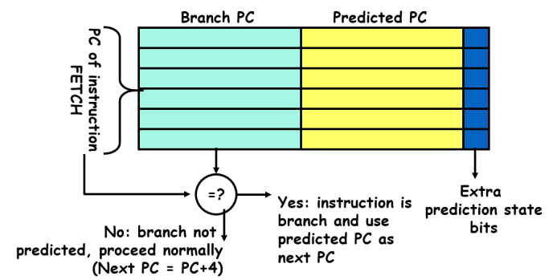

  在基础BTB上，将`state bits`改为2bit，状态图如下

  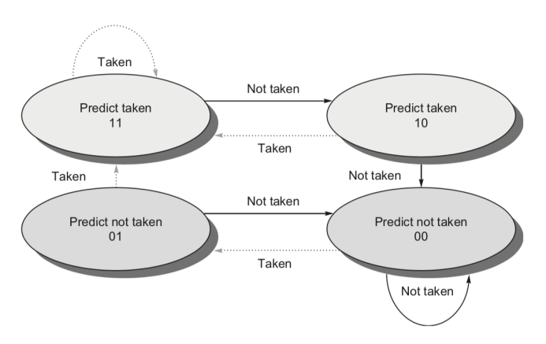

  实验所用CPU的PC地址范围为0x3000-0x33FC，将0至7位用于索引，8-11位用于标签，则BTB每项占用18位（4位标签+12位跳转地址+2位状态），表中项数为2^8=256项

  在IF阶段得到预测结果，在ID阶段判断预测是否正确并更新BTB

  ```verilog
  module BTB(
      input clk,
      input hazard_enable,
      input [31:0] IF_Branch_PC,
      input [31:0] ID_Branch_PC,
      input ID_Branch,
      input ID_Branch_taken,
      input [31:0] ID_Branch_addr,
      output Predicted_Branch_en,
      output [31:0] Predicted_PC
  );
  
  wire [7:0] IF_entry;
  wire [17:0] out_data;
  wire [3:0] tag;
  wire [11:0] predicted_addr;
  
  wire [7:0] ID_entry;
  wire [17:0] in_data;
  
  wire [1:0] state;
  reg [1:0] ID_state;
  reg [1:0] new_state;
  
  //当ID段为分支指令时写入BTB
  dist_mem_gen_2_BTB BTB (
      .a(ID_entry),        // input wire [7 : 0] a
      .d(in_data),        // input wire [17 : 0] d
      .dpra(IF_entry),  // input wire [7 : 0] dpra
      .clk(clk),    // input wire clk
      .we(ID_Branch & hazard_enable),      // input wire we
      .dpo(out_data)    // output wire [17 : 0] dpo
  );
  
  //IF段查询的地址
  assign IF_entry = IF_Branch_PC[7:0];
  //IF段查询的结果
  assign {tag,predicted_addr,state} = out_data;
  //IF预测结果
  assign Predicted_Branch_en = (tag == IF_Branch_PC[11:8]) ? state[1] : 0;
  assign Predicted_PC = {20'h00003,predicted_addr};
  
  //ID段更新的地址
  assign ID_entry = ID_Branch_PC[7:0];
  //ID段更新的数据
  assign in_data = {ID_Branch_PC[11:8],ID_Branch_addr[11:0],new_state};
  //ID段更新的2bit状态
  always @(posedge clk) begin
      if(hazard_enable)
          ID_state <= state;
  end
  always @(*) begin
      case (ID_state)
          2'b11:  new_state = ID_Branch_taken ? 2'b11 : 2'b10;
          2'b10:  new_state = ID_Branch_taken ? 2'b11 : 2'b00;
          2'b01:  new_state = ID_Branch_taken ? 2'b11 : 2'b00;
          2'b00:  new_state = ID_Branch_taken ? 2'b01 : 2'b00;
      endcase
  end
  
  endmodule
  ```

- 修改PC选择器，在预测结果与实际结果不同时冲刷流水线

  ```verilog
  module PC_Mux(
      input taken,
      input Branch_en,
      input Branch_uncond,
      input exception,
      input Predicted_Branch_en,
      input [31:0] result,
      input [31:0] PC,
      input [31:0] mtevc,
      input [31:0] Predicted_PC,
      input [31:0] IFID_PC,
      output [31:0] PC_next,
      output Branch
  );
  
  wire [31:0] true_addr = (taken | Branch_uncond) ? result : (IFID_PC + 32'd4);
  
  assign  
          Branch = (Branch_en | Branch_uncond) && (PC != true_addr),
          PC_next = (exception)? mtevc : (Branch ? true_addr : (Predicted_Branch_en ? Predicted_PC : (PC + 32'd4) ));
  
  endmodule
  
  module PC(
      input clk,
      input enable,
      input [31:0] next,
      output reg [31:0] current
  );
  
  initial begin
      current = 32'h3000;
  end
  
  always @(posedge clk) begin
      if(enable && next <= 32'h33FC)
          current <= next;
  end
  
  endmodule
  ```

- 修改数据通路

  ```verilog
  //分支预测
  BTB BTB(clk,hazard_enable,PC_current,IFID_PC,Branch_en | Branch_uncond,taken | Branch_uncond,((mux_1 == OP1_REG1) ? Forwaringreg_Reg1_Branch : IFID_PC) + imm,Predicted_Branch_en,Predicted_PC);
  PC_Mux PC_Mux(taken,Branch_en,Branch_uncond,CSR_set,Predicted_Branch_en,((mux_1 == OP1_REG1) ? Forwaringreg_Reg1_Branch : IFID_PC) + imm,PC_current,mtevc,Predicted_PC,IFID_PC,PC_next,clear);
  ```
  
### 4.CSR寄存器

- 添加CSR寄存器
  
    > 八个控制状态寄存器（CSR）是机器模式下异常处理的必要部分：
    >
    > ⚫ mtvec（Machine Trap Vector）它保存发生异常时处理器需要跳转到的地址。
    >
    > ⚫ mepc（Machine Exception PC）它指向发生异常的指令。
    >
    > ⚫ mcause（Machine Exception Cause）它指示发生异常的种类。
    >
    > ⚫ mie（Machine Interrupt Enable）它指出处理器目前能处理和必须忽略的中断。
    >
    > ⚫ mip（Machine Interrupt Pending）它列出目前正准备处理的中断。
    >
    > ⚫ mtval（Machine Trap Value）它保存了陷入（trap）的附加信息：地址例外中出错
    >
    > 的地址、发生非法指令例外的指令本身，对于其他异常，它的值为 0。 
    >
    > ⚫ mscratch（Machine Scratch）它暂时存放一个字大小的数据。
    >
    > ⚫ mstatus（Machine Status）它保存全局中断使能，以及许多其他的状态
    >
    
    为支持程序对CSR的读写与中断发生时CSR寄存器的置位，实现了双端口，两个32位的输入输出端口用于程序对CSR进行读写，两个128位的总线输入输出端口用于在中断发生时一次性对CSR进行置位，同时支持写优先以便处理数据冒险
    
    ```verilog
    module CSR(
        input clk,
        input [31:0] data_in,
        input [127:0] in_bus,
        input [11:0] read_addr,
        input [11:0] write_addr,
        input set,
        input we,
        output reg [31:0] data,
        output [127:0] out_bus
    );
    
    parameter  MTVEC = 12'h5;
    parameter  MEPC = 12'h65;
    parameter  MCAUSE = 12'h342;
    parameter  MIE = 12'h304;
    parameter  MIP = 12'h344;
    parameter  MTVAL = 12'h343;
    parameter  MSCRATCH = 12'h340;
    parameter  MSTATUS = 12'h300;
    
    reg [31:0] mtvec;
    reg [31:0] mepc;
    reg [31:0] mcause;
    reg [31:0] mie;
    reg [31:0] mip;
    reg [31:0] mtval;
    reg [31:0] mscratch;
    reg [31:0] mstatus;
    
    initial begin
        mtvec = 32'h3300;
        mstatus = 32'h00001808;
    end
    
    assign out_bus = {mtvec,mie,mip,mstatus};
    
    always @(*) begin
        case (read_addr)
            MTVEC:      data = (write_addr == read_addr && we) ? data_in : mtvec;
            MEPC:       data = (write_addr == read_addr && we) ? data_in : mepc;
            MCAUSE:     data = (write_addr == read_addr && we) ? data_in : mcause;
            MIE:        data = (write_addr == read_addr && we) ? data_in : mie;
            MIP:        data = (write_addr == read_addr && we) ? data_in : mip;
            MTVAL:      data = (write_addr == read_addr && we) ? data_in : mtval;
            MSCRATCH:   data = (write_addr == read_addr && we) ? data_in : mscratch;
            MSTATUS:    data = (write_addr == read_addr && we) ? data_in : mstatus;
            default:    data = 32'dz;
        endcase
    end
    
    always @(posedge clk) begin
        if(set) begin
            {mepc,mcause,mtval,mstatus} = in_bus;
        end
        else if(we) begin
            case (write_addr)
                MTVEC:      mtvec <= data_in;
                MEPC:       mepc <= data_in;
                MCAUSE:     mcause <= data_in;
                MIE:        mie <= data_in;
                MIP:        mip <= data_in;
                MTVAL:      mtval <= data_in;
                MSCRATCH:   mscratch <= data_in;
                MSTATUS:    mstatus <= data_in;
            endcase
        end
    end
    
    endmodule
    ```
    
- 修改ALU模块及其输入，以便CSR指令的执行

  ```verilog
  //op_mux
  parameter OP1_REG1  = 2'b00;
  parameter OP1_PC    = 2'b01;
  parameter OP1_IMM   = 2'b10;
  parameter OP2_REG2  = 2'b00;
  parameter OP2_IMM   = 2'b01;
  parameter OP2_CSR   = 2'b10;
  
  always @(*) begin
  	case(IDEX_mux_1)
  		OP1_REG1: op1 = Forwaringreg_Reg1;
  		OP1_PC: op1 = IDEX_PC;
  		OP1_IMM: op1 = IDEX_imm;
  		default: op2 = 32'bz;
  	endcase
  end
  
  always @(*) begin
  	case(IDEX_mux_2)
  		OP2_REG2: op2 = Forwaringreg_Reg2;
  		OP2_IMM: op2 = IDEX_imm;
  		OP2_CSR: op2 = Forwaringreg_Reg_CSR;
  		default: op2 = 32'bz;
  	endcase
  end
  ```

  ```verilog
  parameter CSRRW_ALU = 5'd11;
  parameter CSRRS_ALU = 5'd12;
  parameter CSRRC_ALU = 5'd13;
  CSRRW_ALU:  result = op1;
  CSRRS_ALU:  result = op1 | op2;
  CSRRC_ALU:  result = (~op1) & op2;
  ```

- 修改段间寄存器，传递CSR相关的数据

  ```verilog
  //流水段寄存器
  IFID IFID(clk,(clear & hazard_enable) | CSR_set,hazard_enable,PC_current + 32'd4,PC_current,instr,IFID_PC_4,IFID_PC,IFID_instr);
  IDEX IDEX(clk,~hazard_enable | CSR_set,Reg_we,mux_1,mux_2,ALU_ctrl,Data_Mem_we,Reg_in_mux,Mem_read,IFID_PC_4,IFID_PC,Reg1,Reg2,imm,wr,r1,r2,opcode,optype,CSR_we,CSR_data,CSR_addr,
  IDEX_Reg_we,IDEX_mux_1,IDEX_mux_2,IDEX_ALU_ctrl,IDEX_Data_Mem_we,IDEX_Reg_in_mux,IDEX_Mem_read,IDEX_PC_4,IDEX_PC,IDEX_Reg1,IDEX_Reg2,IDEX_imm,IDEX_wr,IDEX_r1,IDEX_r2,IDEX_opcode,IDEX_optype,IDEX_CSR_we,IDEX_CSR_data,IDEX_CSR_addr);
  EXMEM EXMEM(clk,CSR_set,IDEX_Reg_we,IDEX_Data_Mem_we,IDEX_Reg_in_mux,IDEX_PC_4,result,Forwaringreg_Reg2,IDEX_wr,IDEX_Mem_read,IDEX_CSR_we,Forwaringreg_Reg_CSR,IDEX_CSR_addr,EXMEM_Reg_we,EXMEM_Data_Mem_we,EXMEM_Reg_in_mux,EXMEM_PC_4,EXMEM_result,EXMEM_Reg2,EXMEM_wr,EXMEM_Mem_read,EXMEM_CSR_we,EXMEM_CSR_data,EXMEM_CSR_addr);
  MEMWB MEMWB(clk,CSR_set,EXMEM_Reg_we,EXMEM_Reg_in_mux,EXMEM_PC_4,EXMEM_result,Mem_data_out,EXMEM_wr,EXMEM_CSR_we,EXMEM_CSR_data,EXMEM_CSR_addr,MEMWB_Reg_we,MEMWB_Reg_in_mux,MEMWB_PC_4,MEMWB_result,MEMWB_Mem_data_out,MEMWB_wr,MEMWB_CSR_we,MEMWB_CSR_data,MEMWB_CSR_addr);
  ```

- 添加前递模块，处理CSR指令相关冒险

    ```verilog
    Forwarding_CSR Forwarding_CSR(IDEX_CSR_addr,EXMEM_CSR_we,EXMEM_CSR_addr,MEMWB_CSR_we,MEMWB_CSR_addr,forwardingreg_mux_CSR);
    Forwaringreg_Mux Forwaringreg_Mux_CSR(MEMWB_result,IDEX_CSR_data,EXMEM_result,forwardingreg_mux_CSR,Forwaringreg_Reg_CSR);
    ```


### 5.中断处理

- 添加中断检测模块，在中断发生时修改CSR寄存器，并跳转至中·断处理程序

  根据发生的中断类型设置`mcause`寄存器，设置中断发生的地址至`mepc`，修改`mtval`、`mstatus`保存中断相关状态

  

  ```verilog
  module Exception(
      input [31:0] pc,
      input [127:0] in_bus,
      input [31:0] alu_in,
      input [6:0] opcode,
      input [5:0] optype,
      output reg CSR_set,
      output reg [127:0] out_bus,
      output wire [31:0] mtvec
  );
  
  parameter INTERRUPT     = 1'b1;
  parameter M_SOFT_INT    = 31'd3; // Machine software interrupt
  parameter M_TIME_INT    = 31'd7; // Machine timer interrupt
  parameter M_EXTER_INT   = 31'd7; // Machine external interrupt
  
  parameter EXCEPTION             = 1'b0;
  parameter ILLE_INSTR_EXC        = 31'd2; // Illegal instruction
  parameter BREAK_EXC             = 31'd3; // Breakpoint
  parameter LOAD_ARRD_MIS_EXC     = 31'd4; //Load address misaligned
  parameter STORE_ARRD_MIS_EXC    = 31'd6; //Store address misaligned
  parameter ENVIR_CALL_M_EXC      = 31'd11; //Environment call from M-mode
  
  parameter I_LOAD_OPCODE     = 7'b0000011;
  parameter S_OPCODE          = 7'b0100011;
  
  wire [31:0] mie;
  wire [31:0] mip;
  wire [31:0] mstatus;
  
  assign {mtvec,mie,mip,mstatus} = in_bus;
  
  always @(*) begin
      case(opcode)
          I_LOAD_OPCODE:begin
              if(alu_in > 32'h0410) begin
                  CSR_set = 1;
                  out_bus = {pc,{EXCEPTION,LOAD_ARRD_MIS_EXC},alu_in,(mstatus & ~(32'h8)) | 32'h80}; //mepc,mcause,mtval,mstatus
              end
              else begin
                  CSR_set = 0;
                  out_bus = 128'dz;
              end
          end
          S_OPCODE:begin
              if(alu_in > 32'h0410) begin
                  CSR_set = 1;
                  out_bus = {pc,{EXCEPTION,STORE_ARRD_MIS_EXC},alu_in,(mstatus & ~(32'h8)) | 32'h80}; //mepc,mcause,mtval,mstatus
              end
              else begin
                  CSR_set = 0;
                  out_bus = 128'dz;
              end
          end
          default:begin
              CSR_set = 0;
              out_bus = 128'dz;
          end
      endcase
  end
  
  endmodule
  ```

  - 修改数据通路

    - 将CSR寄存器与中断检测模块连接

    - 将ALU计算的结果接入中断检测模块，以检测访存越界错误

      ```verilog
      CSR CSR(clk,MEMWB_result,CSR_in_bus,CSR_addr,MEMWB_CSR_addr,CSR_set,MEMWB_CSR_we,CSR_data,CSR_out_bus);
      Exception Exception(IDEX_PC,CSR_out_bus,result,IDEX_opcode,IDEX_optype,CSR_set,CSR_in_bus,mtevc);
      ```

    - 修改PC选择器，在发生中断时跳转至中断处理程序

      ```verilog
      PC_Mux PC_Mux(taken,Branch_en,Branch_uncond,CSR_set,Predicted_Branch_en,((mux_1 == OP1_REG1) ? Forwaringreg_Reg1_Branch : IFID_PC) + imm,PC_current,mtevc,Predicted_PC,IFID_PC,PC_next,clear);
      ```

### 6.RV32I指令集测试

- 测试用汇编程序如下

  计算指令测试部分

  ```assembly
  addi x1 x0 1
  add x1 x1 x1
  andi x1 x1 3
  ori x1 x1 4
  xori x1 x1 1
  addi x2 x0 15
  and x1 x1 x2
  or x1 x1 x2
  xor x1 x1 x2
  sub x1 x1 x2
  sll x1 x1 x2
  srl x1 x1 x2
  slli x1 x1 15
  sra x1 x1 x2
  srai x1 x1 1
  srli x1 x1 1
  lui x1 1
  auipc x1 1
  slt x3 x1 x2
  slt x3 x2 x1
  slti x3 x1 1
  slti x3 x1 -1
  sltiu x3 x1 -1
  sub x2 x2 x1
  sltu x3 x1 x2
  sltu x3 x2 x1
  ```

  跳转指令测试部分

  ```assembly
  addi x1 x0 1
  beq x0 x0 L1
  addi x1 x0 1
  L1: bne x1 x0 L2
  addi x1 x0 1
  L2: bge x1 x0 L3
  addi x1 x1 1
  L3:	blt x0 x1 L4
  L4: jal L5
  L5: sub x1 x0 x1
  bgeu x0 x1 L6
  bltu x0 x1 L6
  L6: addi x1 x1 1
  ```

- 测试结果

  - 运算测试

    测试结果与预期相同，新加入的指令计算结果正确，涉及到的数据冒险都能正确处理

    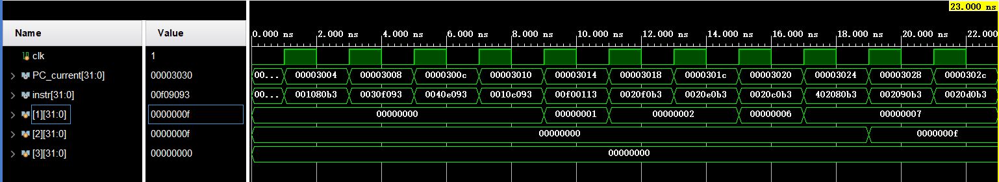

    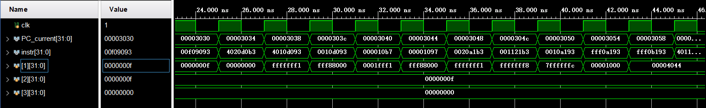

    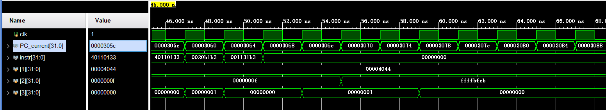

  - 跳转测试

    各跳转指令跳转结果正确

    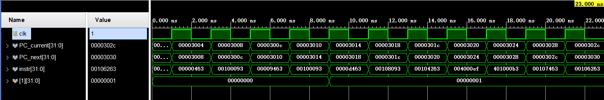

    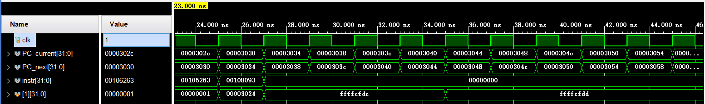

### 7.分支预测测试 

- 效果测试

  使用伪矩阵乘法进行测试（8*8）

  - 汇编代码

    使用三重循环计算矩阵乘法，将结果矩阵各元素相加后，把结果存在x1寄存器
  
    ```assembly
    .text
        xori   a4, zero, 3    # a4寄存器决定了计算的规模，矩阵规模=N*N，N=2^a4。例如a4=4，则矩阵2^4=16阶方阵 该值可以修改
    
        # 以下指令计算3个矩阵（目的矩阵，源矩阵1，源矩阵2）在内存中的起始地址
        # 这三个矩阵在内存中顺序紧挨着存放，例 a4=4，则N=16，则每个矩阵占N*N=256个字，即1024个字
        # 目的矩阵起始地址0  源矩1起始地址1024  源矩2起始地址2048
        # 目的矩阵起始地址放在a2里，源矩1起始地址放在a0里，源矩2起始地址放在a1
        xori   a3, zero, 4
        sll    a3, a3  , a4
        xor    a2, zero, zero
        sll    a0, a3  , a4
        add    a1, a0  , a0
        
        # 始矩阵乘法，使用伪矩阵乘法公式：c_{ij} = \sigma c_{ik}*b{kj}  循环嵌套顺序（从内向外） i,j,k  分别使用 t0,t1,t2 存放 i,j,k
        xor    t0, zero, zero
        MatMulLoopI:
            xor    t1, zero, zero
            MatMulLoopJ:
                xor    t3, zero, zero    #用t3存放内求和循环的累加和，首先将t3清零
                xor    t2, zero, zero
                MatMulLoopK:
                    sll  t4, t0, a4
                    add  t4, t4, t2
                    add  t4, t4, a0
                    lw   t4, (t4)
                    sll  t5, t2, a4
                    add  t5, t5, t1
                    add  t5, t5, a1
                    lw   t5, (t5)
                    and  t4, t4, t5
                    add  t3, t3, t4
                    addi t2, t2, 4
                blt    t2, a3, MatMulLoopK
                sll    t4, t0, a4
                add    t4, t4, t1
                add    t4, t4, a2
                sw     t3, (t4)
                add    x1, x1, t3
                addi   t1, t1, 4
            blt    t1, a3, MatMulLoopJ
            addi   t0, t0, 4
        blt    t0, a3, MatMulLoopI
        
        addi    t0, zero, 1
        sll    t0, t0, a4
        sll    t0, t0, a4
        slli   t0, t0, 2
        addi   t1, zero, 0
    Loop:
        lw     t2, (t1)
        addi   t1, t1, 4
        blt    t1, t0, Loop
    # 计算结束，死循环
    
    InfLoop:
        jal    zero, InfLoop
    ```

  - 随机矩阵生成
  
    输出随机生成的矩阵与相乘后的结果矩阵各元素相加后的值
    
    ```python
    # -*- coding:utf-8 -*-
    # Python2 or Python3
    # Author : WangXuan
    # 
    # 功能： 生成针对于矩阵乘法(matmul)的 mem.sv ，里面存放两个要进行相乘的初始矩阵
    # 
    
    import sys
    from random import randint
    
    if len(sys.argv) != 2:
        print('    Usage:\n        python generate_mem_for_matmul.py [matrix size]')
        print('    Example:\n        python generate_mem_for_matmul.py 16')
        print('    Tip: use this command to write to file:\n        python generate_mem_for_matmul.py 16 > mem.sv')
    else:
        try:
            N = int( sys.argv[1] )
        except:
            print('    *** Error: parameter must be integer, not %s' % (sys.argv[1], ) )
            sys.exit(-1)
        if N<=1:
            print('    *** Error: parameter must be larger than 1, not %d' % (N, ) )
            sys.exit(-1)
        
        A, B, C = [], [], []
        for i in range(N):
            Aline, Bline, Cline = [], [], []
            for j in range(N):
                Aline.append( randint(0,0xffffffff) )
                Bline.append( randint(0,0xffffffff) )
                Cline.append( 0 )
            A.append(Aline)
            B.append(Bline)
            C.append(Cline)
        
        for i in range(N):
            for j in range(N):
                for k in range(N):
                    C[i][j] += A[i][k] & B[k][j]
    
        result = 0;
        for i in range(N):
            for j in range(N):
                print("%08x" % (0) )
                result = (result + C[i][j]) & 0xffffffff
        # src matrix A
        for i in range(N):
            for j in range(N):
                print("%08x" % (A[i][j]) )
        # src matrix B
        for i in range(N):
            for j in range(N):
                print("%08x" % (B[i][j]))
        print('// result')
        print("%08x" % (result) )
    ```
  
    生成结果如下
    
    ```bash
    00000000
    00000000
    00000000
    00000000
    00000000
    00000000
    00000000
    00000000
    00000000
    00000000
    00000000
    00000000
    00000000
    00000000
    00000000
    00000000
    00000000
    00000000
    00000000
    00000000
    00000000
    00000000
    00000000
    00000000
    00000000
    00000000
    00000000
    00000000
    00000000
    00000000
    00000000
    00000000
    00000000
    00000000
    00000000
    00000000
    00000000
    00000000
    00000000
    00000000
    00000000
    00000000
    00000000
    00000000
    00000000
    00000000
    00000000
    00000000
    00000000
    00000000
    00000000
    00000000
    00000000
    00000000
    00000000
    00000000
    00000000
    00000000
    00000000
    00000000
    00000000
    00000000
    00000000
    00000000
    550f7fd8
    79461544
    3a450cf9
    02e901bb
    ab33afe6
    cc96e7d9
    8931075c
    f5911e4f
    0084040b
    491f7d04
    bff00808
    22c074a9
    0e0445ad
    68cca792
    04b70839
    2de3c977
    dcc160ff
    e86add46
    4fabebaf
    06234ba6
    ca2f12b5
    aeba29d5
    30e8537a
    1883e464
    d1d947af
    7d391970
    bcc00104
    be5fa6ae
    7e94cf52
    20bab2a0
    49c82dc5
    af78b194
    84176c61
    6073235d
    4df17930
    da295b30
    740158cc
    b0f9c247
    ebfb6ddc
    da19d5e7
    606b713a
    8a63a4d7
    51531a1a
    0fd3b16b
    2f99b547
    b8c5529e
    e327300b
    5a9ab664
    f2ecfe52
    c28dee51
    f9c5a216
    623dde06
    14c21855
    a1e49459
    c9c50289
    65590a76
    e361afaa
    54f96976
    1230c099
    1b6aa034
    47533c98
    88b73b8a
    5ef00a2d
    8db97d03
    a0a9a649
    ff2a9dfb
    81a4dc9c
    221cfc4b
    6f51d6a6
    6ec8237f
    8790d123
    ba4552a2
    a5871d9a
    43d10e7f
    7d0dc0fb
    45c8d870
    23fc6d88
    36253fa3
    e4a22886
    a87e805c
    04c99c7b
    e1db24ec
    8bb0f737
    32e72e16
    089ed95b
    af96a446
    fe9d3fec
    071ac9e0
    51b58026
    1dfee13a
    3e5cfeef
    10ec4cf7
    ecbf663c
    7f91f2f1
    84978bac
    4ec45747
    acb3eb82
    3c69f20d
    6264e4a6
    df3473cc
    dcd63569
    ec41197e
    6fbd8fef
    745e0cc9
    9991cf27
    14f89d0d
    fcaf1d2a
    358f75e7
    32e83b19
    09f45e4a
    add76784
    e92ff7b2
    0d9c0304
    c968ef87
    29e09b4f
    ed84aaf5
    40eda84b
    2ba730eb
    8c4f0120
    25142cd0
    a1df432a
    a906e084
    fa54fff7
    0c5c1641
    19f62d98
    fdee4aee
    d5d529f0
    8d7a4695
    // result
    4f36ff67
    ```
    
  - 仿真结果
  
    有分支预测的测试结果
    
    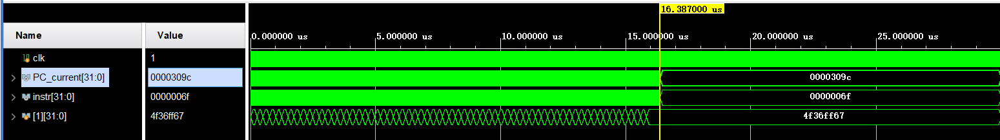
    
    无分支预测的测试结果
  
    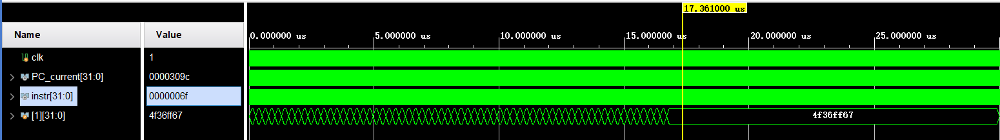
    
    在添加分支预测前后计算结果均正确
    
  - 结果分析
  
    采用不分支预测需17361ns，采用分支预测需16387ns，减少周期数占总周期比例为
    $$
    \frac{17361-16387}{17361} \approx 0.056
    $$
    
  
    在执行中，跳转指令在总指令中百分比为
    $$
    \frac{((((1*8)+1)*8)+1)*8}{((((12*8)+9)*8)+3)*8} \approx 0.0866
    $$
    记每条分支指令在预测后少占用x个周期
    $$
    \frac{0.0866x}{1+0.0866} \approx 0.056
    $$
    即优化后，每条分支指令平均少停顿0.7个周期，在计算矩阵乘法的三重循环中，最内重循环指令执行的次数最多，最内重循环以8次为一个周期，每周期的第一次与最后一次预测失败，中间六次预测成功，则理论平均减少周期数为
    $$
    \frac{6}{8} = 0.75 \approx 0.7
    $$
    
    
    实验结果与理论值较接近，证明了分支预测的有效性

### 8.CSR指令与中断测试

- 测试用汇编程序如下

  倒数第三行之前为CSR寄存器相关指令测试，测试了CSR指令之间的数据冒险，CSR与其他指令之间的数据冒险，最后测试了在`sw`指令访存地址越界下的中断

  ```assembly
  addi x2 x0 15
  csrrw  x1 utvec x2
  add x3 x1 x1
  add x4 x0 x1
  csrrw x1 utvec x3
  csrrw x1 utvec x0
  csrrw x1 utvec x3
  csrrs x1 utvec x3
  csrrc x2 utvec x3
  csrrwi x1 utvec 10
  csrrsi x1 utvec 3
  csrrci x1 utvec 8
  add x0 x0 x0
  add x0 x0 x0
  sw x1 -1(x0)
  ```

- 仿真结果

  CSR相关指令的存取结果均正确，在`sw`指令发生访存越界时，发生中断，跳转到此时`mtvec`的地址，同时修改`mepc`、

  `mcause`、`mtval`、`mstatus`存储引起中断的pc地址、中断原因、中断值、中断后的状态

  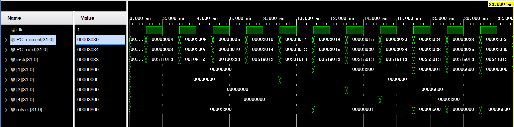
  
  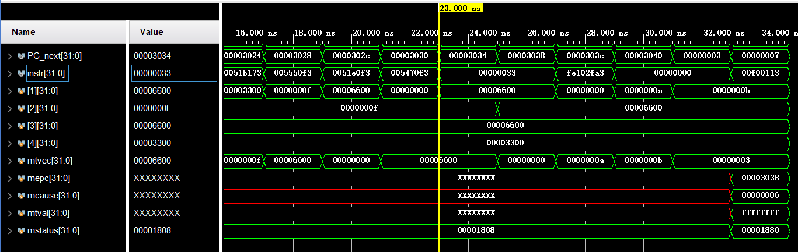

## 五、心得体会

​	在这次实验中，我学习了RV32I的剩余指令，分支预测，中断处理的实现，并了解了软硬件综合系统的设计和调试方法，学会了对模块进行测试的方法，对RISCV的CPU架构有了更深入的理解
